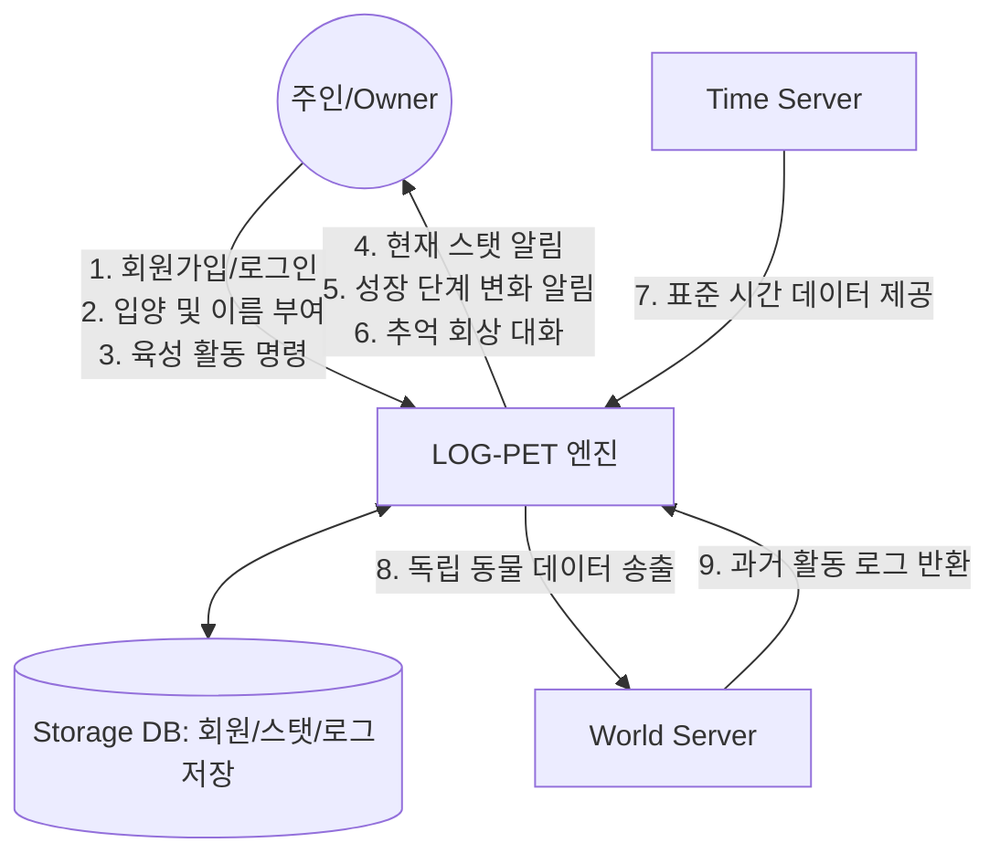

# Log_Pet
반려동물 성장 및 독립 시뮬레이션

# 1. Business purpose
과거 공동체 중심의 따뜻한 정을 나누던 사회 분위기와 달리 현대 사회는 개인주의의 심화와 비대면 문화의 확산 등으로 안해 불특정 다수를 경계하고 독립적이고 고립되는 경향이 뚜렷해졌습니다. 이러한 사회적 변화 속에서 많은 현대인은 극심한 외로움과 정서적인 허기짐을 느끼고 있으며 이를 해소하기 위해 조건 없는 사랑을 주는 반려동물에 대한 관심이 어느 때보다 높아지고 있습니다. 그러나 1인 가구의 증가와 원룸, 다세대 주택 등 주거 환경의 제약, 그리고 경제적 부담이나 알레르기와 같은 현실적인 문제로 인해 실제로 반려동물을 입양하여 책임지는 것은 결코 쉬운 일이 아닙니다. 저는 이러한 현실적 장벽을 허물고 온라인상에서 반려동물과의 정서적 교감을 충분히 경험할 수 있는 디지털 환경을 구축하고자 본 프로젝트를 기획하게 되었습니다. 기존의 단순 반복형 육성 게임이 가진 한계를 극복하고 사용자에게 진정한 '생명의 순환'과 '책임감'을 전달하는 것을 목표로 합니다.

 이 프로젝트의 목표는 단순 반복형 육성 게임이 가진 한계를 극복하고, 사용자에게 진정한 '생명의 순환'과 '책임감'을 전달하는 것입니다. 사용자는 자신이 키울 동물의 종을 직접 선택하고 이름을 부여함으로써 세상에 하나뿐인 나만의 동료 객체를 생성합니다. 이 과정은 사용자에게 단순한 소프트웨어 사용 이상의 애착 관계를 형성하게 합니다. 아기 단계부터 성체 단계에 이르기까지, 시간의 흐름과 사용자의 케어 방식에 따라 외형과 행동 패턴이 가변적으로 변화하는 정교한 성장 엔진을 구현합니다. 이는 사용자에게 동물이 '살아있다'는 생동감을 전달합니다. 본 프로젝트의 가장 큰 특징은 무한한 소유가 아닌 '건강한 독립'에 있습니다. 일정 기간 정성을 다해 돌보고 목적을 달성하면 동물을 더 넓은 세상으로 보내주는 이별 의식을 진행합니다. 이를 통해 사용자는 만남의 기쁨뿐만 아니라 독립을 응원하는 성숙한 이별의 과정을 경험하며 정서적 완성을 이룹니다.
 
 이 프로젝트의 타겟은 반려동물을 키우고 싶으나 여건이 되지 않는 학생들, 심적인 힐링이 필요한 직장인들 정도로 예상합니다.

 # 2.System context diagram

 # 3.

1) 회원가입
ACTOR- Owner, Storage DB
DESCRIPTION-주인이 사용할 아이디와 비밀번호를 입력하면, 시스템은 중복 여부를 확인 후 Storage DB에 새로운 사용자 계정을 생성합니다.
2) 로그인
ACTOR- Owner, Storage DB
DESCRIPTION-주인이 입력한 정보가 Storage DB의 회원 정보와 일치하는지 확인하고 시스템 접근 권한을 부여합니다.
3) 반려동물 등록
ACTOR-Owner, Storage DB
DESCRIPTION-로그인이 완료된 주인이 동물의 종을 선택하고 이름을 부여하면, 시스템은 신규 반려동물 객체를 생성하여 DB에 기록합니다.
4) 데이터 동기화
ACTOR-Owner, Time Server
DESCRIPTION-접속 시점마다 Storage DB의 기존 데이터와 Time Server의 현재 시간을 대조하여 부재 중 경과된 시간만큼 스탯을 자동 갱신합니다.
5) 상태조회
ACTOR-Owner, Storage DB
DESCRIPTION-주인이 현재 동물의 배고픔, 청결도, 호감도 등의 수치를 시각적인 테이블 형태로 실시간 모니터링할 수 있도록 돕습니다.
6) 육성 관리
ACTOR-Owner, Storage DB
DESCRIPTION-주인이 먹이 주기, 산책, 씻기기 등의 명령을 실행하면 시스템은 즉각 수치를 변경하고 그 결과를 Storage DB에 실시간 저장합니다.
7) 성장
ACTOR-System, Storage DB
DESCRIPTION-동물이 특정 경험치와 성장 시간을 충족하면 시스템이 자동으로 아기에서 성체로 외형 클래스를 변경하고 이를 DB에 업데이트합니다.
8) 동물 세상
ACTOR-Owner, World Server, Storage DB
DESCRIPTION-육성 목적을 달성한 동물을 주인이 승인하면 데이터를 Animal World Server로 전송하고, Storage DB 내의 활성 데이터를 졸업 처리합니다.
9)추억 기록 출력
ACTOR-Owner, World Server
DESCRIPTION-동물 세상에 있는 아이를 불러옵니다. 동물은 과거 활동 로그를 바탕으로 무작위 '회상 대화'를 건넵니다

# 4.Concept of operation
1) 회원가입 
Purpose: 개별 사용자를 식별하기 위한 고유 계정 생성.

Approach: 사용자가 아이디를 입력하면 Storage DB에서 중복을 확인한 후 계정을 생성합니다.

Dynamics: 최초 이용 시 발생하며, 이후 모든 데이터는 이 계정에 귀속됩니다.

Goals: 사용자별 개인화된 육성 데이터 관리.

2) 로그인 
Purpose: 사용자를 인증하고 기존의 육성 환경을 복구함.

Approach: 입력된 정보를 Storage DB와 대조하여 일치 시 메인 엔진을 구동합니다.

Dynamics: 앱 실행 시 매번 발생하며 보안과 데이터 연속성을 보장합니다.

3) 반려동물 등록
Purpose: 고유 이름을 가진 디지털 생명체 객체 생성.

Approach: 종 선택과 이름 입력을 통해 Storage DB에 새 동물 인스턴스를 생성합니다.

Dynamics: 육성 대상이 없을 때 발생하며 정서적 유대의 시작점이 됩니다.

4) 데이터 동기화
Purpose: 실제 흐른 시간만큼 동물의 상태를 물리적으로 반영함.

Approach: Time Server의 현재 시간과 DB의 마지막 접속 시간을 계산하여 수치를 차감합니다.

Dynamics: 로그인 직후 자동으로 실행되어 현실감을 부여합니다.

5) 상태 조회
Purpose: 동물의 욕구를 시각적으로 파악하여 즉각적인 대응을 유도함.

Approach: Time Server의 흐름에 따라 변화하는 수치를 UI 게이지로 실시간 출력합니다.

Dynamics: 앱 구동 중 지속적으로 발생하며 관리의 긴장감을 유지합니다.

6) 육성 관리
Purpose: 상호작용을 통해 동물을 성장시키고 활동 기록을 남김.

Approach: 주인이 명령을 내리면 수치가 변하며, 이 활동(예: '초코'에게 '사과'를 줌)이 Storage DB에 로그로 남습니다.

Dynamics: 주인이 능동적으로 버튼을 클릭할 때마다 발생합니다.

7) 성장
Purpose: 육성의 결과물을 시각적인 신체 변화로 보상함.

Approach: 경험치가 쌓이면 시스템이 외형 클래스를 교체하고 Storage DB에 성장 이력을 업데이트합니다.

Dynamics: 레벨업 조건을 달성하는 순간 시스템 엔진에 의해 실행됩니다.

8) 동물 세상
Purpose: 육성 완료 후 동물을 해방시키고 모든 활동 로그를 추억 데이터로 아카이빙함.

Approach: 주인의 승인 하에 모든 데이터를 World Server로 전송하여 '영구 기억' 상태로 변환합니다.

Dynamics: 최종 성장 및 기간 만료 시점에 발생하여 감동적인 엔딩을 제공합니다.

9) 추억 기록 출
Purpose: 떠나보낸 동물과 다시 만나 정서적 위안을 얻음.

Approach: World Server에서 해당 동물을 호출합니다. 동물의 AI가 아닌, 저장된 활동 로그 중 하나를 랜덤 추출하여 "그때 준 사과 맛있었어요" 같은 대사로 치환해 출력합니다.

Dynamics: 사용자가 동물 세상 방문 기능을 사용할 때 발생하며, 과거의 육성 경험을 되새기게 합니다.

Goals: 단순 기록 출력을 넘어선 정서적 피드백 제공.
# 5. Problem statement
'LOG-PET'를 설계하며 직면한 여러 가지 문제점과 소프트웨어의 완성도를 위해 고려해야 할 사항들을 다양한 관점에서 기술한다. 단순히 기능의 구현 가능성을 넘어, 사용자에게 전달될 정서적 가치와 시스템의 안정성을 확보하기 위한 근본적인 고민들을 담았다.

첫 번째는 시간 동기화와 데이터 정합성 유지의 문제이다. 본 소프트웨어는 사용자가 앱을 종료한 상태에서도 동물의 허기나 청결도 수치가 실시간으로 차감되어야 현실감을 줄 수 있다. 그러나 클라이언트 기기의 로컬 시간은 사용자가 임의로 수정할 수 있다는 보안상의 허점이 존재한다. 이를 방지하기 위해 외부의 표준 시간 API를 활용하여 접속 시마다 절대 시간을 대조하는 로직을 구현해야 한다. 하지만 네트워크가 불안정한 환경에서는 이 동기화 과정에서 오차가 발생할 수 있으므로 예외 상황에서도 데이터가 꼬이지 않도록 세심한 주의를 기울여야 할 것이다.

두 번째는 서버 구축의 현실적인 한계와 대안이다. 다수의 클라이언트가 접속하는 실제 네트워크 서버를 구축하고 유지하는 것은 기술적 숙련도와 비용 면에서 큰 어려움이 있다. 따라서 예시 프로젝트들의 사례를 참고하여, 실제 물리 서버를 구축하는 대신 시스템 내부에 'Virtual Server'와 'Storage DB' 역할을 하는 클래스를 생성하여 동작하도록 설계하였다. 데이터는 실제 데이터베이스 엔진 대신 파일 입출력 방식을 채택하여 텍스트 파일 형태로 관리할 예정이다. 비록 실제 서버는 아니지만 로직상으로는 서버-클라이언트의 데이터 교환 방식을 그대로 모사하여 소프트웨어의 구조적 완성도를 높이고자 한다.

세 번째는 '추억의 재회' 시스템 구현을 위한 데이터 활용의 어려움이다. 단순히 과거 기록을 텍스트로 출력하는 것은 사용자의 몰입을 방해할 수 있다. 인공지능 대화 엔진을 직접 구현하는 것은 범위 밖의 일이기 때문에 우리는 동물이 과거의 활동 로그를 기반으로 대화를 건네는 방식을 고안했다. 이를 위해서는 동물을 키우는 동안 발생하는 수많은 상호작용을 하나하나 데이터 테이블화하여 저장해야 한다. 재회 시 이 방대한 로그 중에서 어떤 데이터를 우선적으로 추출하여 대사 템플릿에 주입할지에 대한 알고리즘 설계가 이 프로젝트의 핵심적인 도전 과제가 될 것이다.

네 번째는 성장 단계 전이에 따른 리소스 관리 문제이다. 동물이 아기 단계에서 성체로 성장할 때 외형뿐만 아니라 행동 패턴과 소모 수치의 가중치가 변하게 된다. 이러한 변화를 매끄럽게 처리하기 위해 클래스 설계 시 상속과 다형성을 적극 활용해야 한다. 만약 단계 변화 시 데이터 처리가 늦어진다면 사용자는 시스템의 오류로 인식할 것이므로 부드러운 화면 전환과 데이터 업데이트가 동시에 이루어질 수 있도록 관리에 많은 시간을 써야 할 것이다.

다음은 'LOG-PET'의 NFS에 대한 내용이다.

1. 반응성: 사용자가 로그인하거나 데이터를 요청했을 때, 파일 저장소에서 정보를 읽어와 화면에 나타내는 시간은 3초 미만이어야 한다.
2. 효율성: 모든 육성 관리의 결과값은 페이지 전환 없이 즉각적으로 UI에 반영되어야 한다.
3. 호환성: 본 어플리케이션은 다양한 안드로이드 기기에서의 구동을 위해 최소 안드로이드 Lollipop 버전까지 지원해야 한다.
4. 신뢰성: 모든 성장 데이터와 활동 로그는 비정상적인 종료 시에도 유실되지 않고 안전하게 파일로 백업되어야 한다.
5. 심미성: 동물의 상태 변화를 사용자가 직관적으로 알 수 있도록 끊김 없는 부드러운 애니메이션 효과를 제공해야 한다.

 # 6.Glossary
LOG-PET: 본 프로젝트의 명칭으로, 반려동물의 성장 기록과 육성의 결합을 의미한다.

Virtual Server: 실제 물리적 서버를 대신하여 프로그램 내부에서 서버의 기능을 수행하도록 모사된 클래스 구조이다.

Storage DB: 회원 정보 및 동물의 성장 데이터를 파일 시스템 형태로 저장하고 관리하는 내부 모듈이다.

Time Server: 기기 시간 조작을 방지하고 정확한 스탯 계산을 위해 외부에서 표준 시간 정보를 받아오는 시스템을 뜻한다.

Interaction: 주인이 동물을 돌보기 위해 수행하는 먹이 주기, 산책, 세척 등의 모든 육성 활동을 통칭한다.

Activity Log : 육성 중 발생한 모든 인터랙션 데이터를 의미하며 훗날 '추억의 재회' 기능을 구현하는 핵심 데이터가 된다.

GrowthStage: 동물의 발달 정도를 구분하는 단위로 단계에 따라 외형과 필요 수치 가중치가 달라진다.

Independence: 성장을 마친 동물이 시스템의 관리 영역을 벗어나 '동물 세상'으로 이동하는 서사적 엔딩 과정이다.

Recall Conversation: 독립한 동물이 과거의 활동 로그를 바탕으로 특정 기억을 언급하며 사용자에게 건네는 메시지 시스템이다.

# 7.Reference
현재까지의 참고문항은 따로 없음
