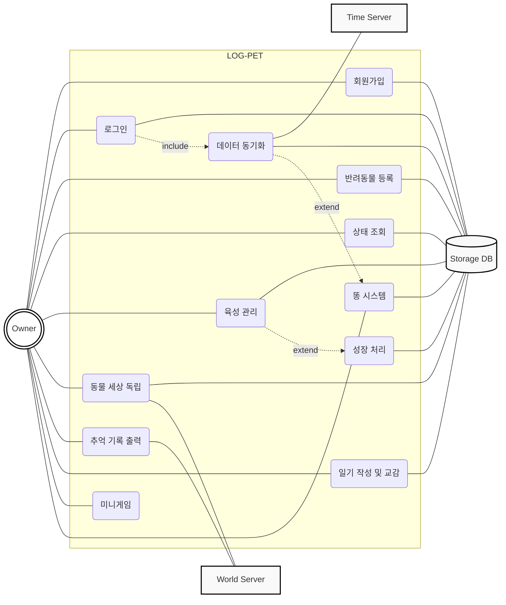
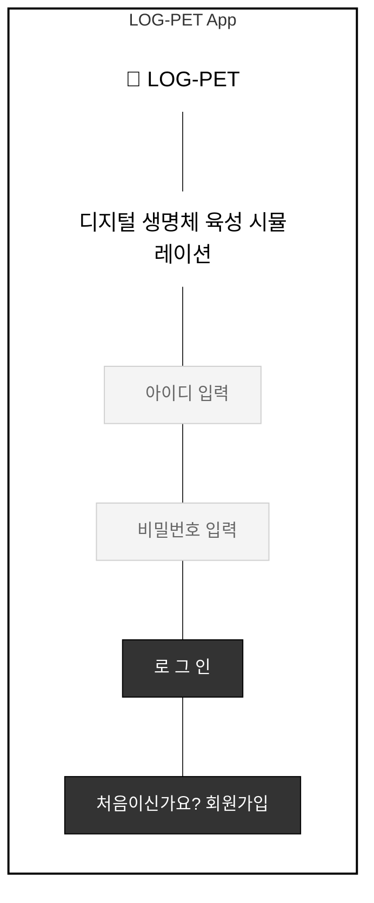
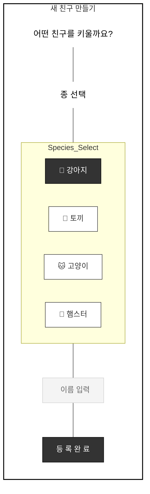
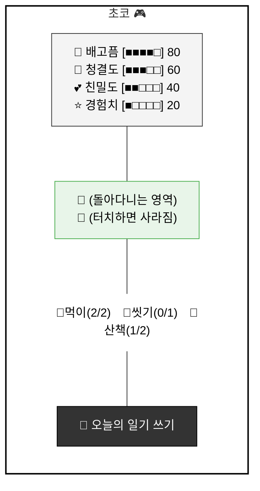
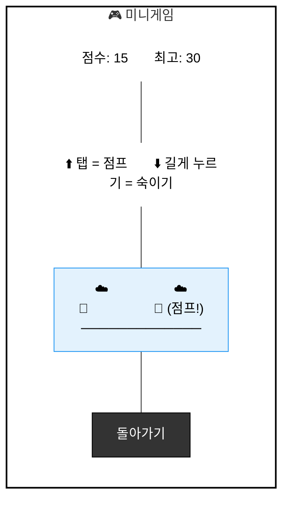
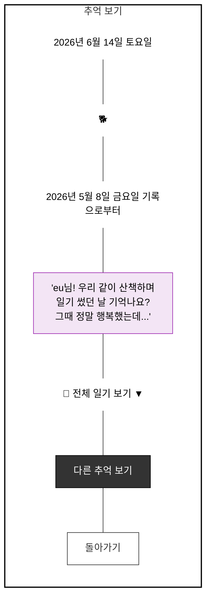

# 1. Introduction

## 1) Summary
우리는 하루를 마치며 오늘의 사건과 감정을 기록하고 싶어 하지만, 단순한 텍스트 위주의 일기는 지속하기가 어렵고 금방 지루함을 느끼곤 한다.
반면, 현대인들은 정서적 교감을 위해 반려동물을 키우고 싶어 하지만 현실적인 제약으로 인해 포기하는 경우가 많다.
이러한 두 가지 문제를 동시에 해결하기 위해 고안한 시스템이 바로 'LOG-PET'이다.
본 시스템은 사용자가 반려동물을 돌보는 행위 자체가 하나의 일기가 되도록 설계되었다.
사용자가 오늘 있었던 일을 동물에게 들려주거나 기록하면 시스템은 이를 단순한 저장에 그치지 않고 동물의 상태 수치와 대화에 반영한다.
즉, 사용자는 반려동물을 키우기 위해 자연스럽게 하루를 기록하게 되고 동물은 그 기록을 바탕으로 사용자에게 반응하며 정서적 위안을 제공한다.
결과적으로 본 소프트웨어는 단순한 육성 게임을 넘어 사용자의 일상이 기록된 소중한 성장 다이어리의 역할을 수행하고자 한다.

## 2) Description of Project Features

**2-1. 일기 기반의 상호작용**
사용자가 오늘의 주요 사건이나 감정을 입력하면 시스템은 이를 '로그'로 저장함과 동시에 동물의 호감도를 상승시킨다.
단순히 버튼을 누르는 육성이 아니라 사용자의 실제 일상을 동물과 공유함으로써 기록의 동기를 부여하고 정서적 유대를 강화한다.

**2-2. 텍스트 분석을 통한 감정 피드백**
사용자가 작성한 일기 내용 중 특정 키워드나 감정을 시스템이 파악하여 동물의 반응을 결정한다.
예를 들어 사용자가 우울한 내용을 기록하면 동물이 위로의 말풍선을 출력하거나 기쁜 내용을 기록하면 함께 즐거워하는 말풍선을 출력하여 실시간 교감의 깊이를 높인다.

**2-3. 추억의 재회 시스템**
동물이 독립한 이후에도 사용자가 작성했던 과거의 일기 내용들은 World Server에 영구 보관된다.
사용자가 떠나보낸 아이를 다시 불러오면 동물은 과거 일기장의 특정 날짜 기록을 언급하며 "그날은 이런 일이 있었죠?"와 같은 대사를 건네어 사용자가 자신의 과거를 회상할 수 있는 통로 역할을 한다.

**2-4. 시간 동기화 및 데이터 관리**
실제 시간의 흐름에 따라 일기 작성 주기를 관리하며 외부 서버 연동을 통해 하루에 한 번 정해진 시간에 기록을 유도한다.
모든 기록은 사용자의 계정별로 Storage DB에 안전하게 관리되어 기기를 변경하더라도 소중한 일상 기록과 동물의 성장 데이터가 유지되도록 한다.

**2-5. 반려동물 생동감 시스템**
반려동물이 화면을 자유롭게 돌아다니며 터치 시 반응한다.
일정 시간마다 똥을 싸며 최대 5개까지 쌓이고 사용자가 터치하면 사라진다.
앱이 꺼진 상태에서도 경과 시간에 따라 똥이 쌓인다.

**2-6. 미니게임**
키우는 반려동물이 주인공인 장애물 피하기 게임을 제공한다.
탭으로 점프, 길게 누르기로 숙이기를 수행하며 점수에 따라 속도가 빨라진다.
낮은 장애물(선인장)은 점프로, 높은 장애물(독수리)은 숙이기로 피해야 한다.

**2-7. 사운드 시스템**
배경음악이 무한 반복 재생되며 볼륨 조절이 가능하다.
먹이주기, 씻기기, 산책, 쓰다듬기, 성장 등 각 액션마다 고유한 효과음이 재생된다.

---

# 2. Use Case Analysis

## 1) Use Case Diagram

---

## 2) Use Case Descriptions

### Use Case #1: 회원가입

| 항목 | 내용 |
|---|---|
| Summary | 사용자가 'LOG-PET'을 처음 이용하고자 할 때, 고유 계정을 생성하여 개인화된 육성 환경을 구축한다 |
| Scope | LOG-PET (반려동물 성장 및 독립 시뮬레이션 시스템) |
| Level | User Level |
| Last Update | 2026-05-08 |
| Status | Analysis |
| Primary Actor | Owner |
| Preconditions | 1. 시스템(App)이 정상적으로 실행되어야 한다. 2. 가상 서버(Virtual Server) 및 Storage DB 모듈이 활성화되어야 한다 |
| Trigger | 메인 초기 화면에서 [회원가입] 버튼을 선택한다 |
| Success Post Condition | 입력한 정보가 Storage DB에 저장되며 회원가입 성공 메시지가 출력된다 |
| Failed Post Condition | 계정 생성이 취소되며 오류 메시지와 함께 회원가입 양식 입력 화면이 유지된다 |

**Step-Action**

S. 사용자가 시스템에 새로운 계정을 등록한다.
1. 사용자는 LOG-PET 어플리케이션을 실행한다.
2. 사용자는 초기 화면 메뉴 중 [회원가입]을 선택한다.
3. 시스템은 아이디, 비밀번호, 비밀번호 확인, 닉네임 입력을 위한 양식을 화면에 출력한다.
4. 사용자는 각 항목에 정보를 기입하고 [등록] 버튼을 누른다.
5. 시스템은 Storage DB에 데이터 검증을 요청한다.
6. 시스템은 아이디 중복 여부를 확인한다.
7. 중복이 없고 양식이 올바를 경우, 새로운 사용자 객체를 생성하여 DB에 기록한다.
8. 회원가입 완료 메시지를 띄우고 다시 로그인 화면으로 이동하며 종료한다.

**Step-Branching Action**

| 분기 | 조건 | 처리 |
|---|---|---|
| 4a | 필수 입력 항목 누락 | "모든 정보를 입력해야 합니다" 경고 출력, 화면 유지 |
| 4b | 비밀번호 불일치 | "비밀번호가 일치하지 않습니다" 메시지 출력, 비밀번호 초기화 |
| 6a | 중복 아이디 | "이미 존재하는 아이디입니다" 에러 출력, 아이디 입력란으로 이동 |
| 7a | Storage DB 쓰기 오류 | "시스템 오류로 가입에 실패했습니다" 알림, 초기 화면으로 이동 |

| Performance | Frequency | Concurrency |
|---|---|---|
| 3초 미만 | 신규 사용자 유입 시 최초 1회 | 고려하지 않음 |

---

### Use Case #2: 로그인

| 항목 | 내용 |
|---|---|
| Summary | 사용자가 등록된 계정 정보를 입력하여 인증을 받고 기존의 육성 환경과 반려동물 데이터를 복구한다 |
| Primary Actor | Owner |
| Preconditions | 1. 시스템이 실행 중이어야 한다. 2. Storage DB에 최소 하나 이상의 사용자 계정 데이터가 존재해야 한다 |
| Trigger | 초기 화면에서 로그인 정보를 입력하고 [로그인] 버튼을 선택한다 |
| Success Post Condition | 메인 엔진이 구동되며 데이터 동기화가 자동으로 연쇄 실행된다 |
| Failed Post Condition | 인증 실패 메시지를 출력하며 시스템 접근 권한이 제한된다 |

**Step-Action**

S. 사용자가 시스템 인증을 통해 기존 데이터를 불러온다.
1. 사용자는 자신의 아이디와 비밀번호를 입력하고 로그인을 요청한다.
2. 시스템은 Storage DB 파일에서 해당 아이디와 일치하는 레코드를 검색한다.
3. 시스템은 입력된 비밀번호가 저장된 데이터와 일치하는지 대조한다.
4. 일치할 경우, 시스템은 해당 사용자의 반려동물 인스턴스 정보를 메모리에 로드한다.
5. 시스템은 메인 화면을 활성화하고 동기화(UC-4) 로직을 호출하며 종료한다.

**Step-Branching Action**

| 분기 | 조건 | 처리 |
|---|---|---|
| 3a | 아이디 없음 또는 비밀번호 불일치 | "계정 정보가 올바르지 않습니다" 출력, 로그인 화면으로 복귀 |

| Performance | Frequency | Concurrency |
|---|---|---|
| 3초 미만 | 앱 실행 시 매번 | 고려하지 않음 |

---

### Use Case #3: 반려동물 등록

| 항목 | 내용 |
|---|---|
| Summary | 로그인을 완료한 사용자가 시스템 내에서 육성할 고유의 반려동물 객체를 생성하고 초기화한다 |
| Primary Actor | Owner |
| Preconditions | 1. 사용자가 성공적으로 로그인한 상태여야 한다. 2. 해당 계정에 활성화된 반려동물 데이터가 존재하지 않아야 한다 |
| Trigger | 로그인 후 반려동물이 없을 경우 나타나는 새 친구 만들기 화면에서 정보를 입력한다 |
| Success Post Condition | 새로운 반려동물 인스턴스가 생성되어 사용자의 계정에 귀속되고 Storage DB에 저장된다 |
| Failed Post Condition | 반려동물 객체가 생성되지 않으며 입력을 완료할 때까지 메인 육성 화면으로 진입이 제한된다 |

**Step-Action**

S. 사용자가 육성할 새로운 디지털 반려동물을 시스템에 등록한다.
1. 시스템은 반려동물의 종 리스트(강아지/토끼/고양이/햄스터)와 이름 입력창을 화면에 제공한다.
2. 사용자는 제공된 리스트에서 원하는 종을 선택한다.
3. 사용자는 반려동물에게 부여할 고유한 이름을 텍스트로 입력한다.
4. 사용자가 [등록 완료] 버튼을 누른다.
5. 시스템은 선택된 종에 해당하는 기본 스탯(허기 100, 청결 100 등)과 외형 클래스를 할당한다.
6. 시스템은 생성된 반려동물 객체 데이터를 Storage DB에 기록한다.
7. 등록 성공 메시지와 함께 반려동물의 초기 상태가 표시되는 메인 육성 화면으로 이동한다.

**Step-Branching Action**

| 분기 | 조건 | 처리 |
|---|---|---|
| 3a | 이름 미입력 | "반려동물의 이름을 입력해주세요" 경고, 이름 입력란으로 포커스 이동 |
| 3b | 이름에 특수문자 포함 | "사용할 수 없는 이름 형식입니다" 출력, 재입력 요구 |
| 6a | DB 쓰기 오류 | "데이터 저장에 실패했습니다" 알림, 재시도 버튼 활성화 |

| Performance | Frequency | Concurrency |
|---|---|---|
| 1초 미만 | 계정당 최초 1회 (또는 독립 후 새 등록 시) | 없음 |

---

### Use Case #4: 데이터 동기화

| 항목 | 내용 |
|---|---|
| Summary | 사용자가 시스템에 접속하지 않은 시간 동안의 실제 경과 시간을 계산하여 반려동물의 상태 수치를 물리적으로 자동 반영한다 |
| Primary Actor | Owner, Time Server |
| Preconditions | 1. 사용자가 로그인에 성공하여 시스템 메인 엔진이 구동되어야 한다. 2. Storage DB에서 마지막 접속 시점의 Timestamp 데이터가 로드되어야 한다 |
| Trigger | 로그인이 완료된 직후 시스템에 의해 자동으로 실행된다 |
| Success Post Condition | 부재 시간만큼 차감된 스탯이 UI 게이지에 즉각 반영되며 Storage DB 내의 데이터가 최신화된다 |
| Failed Post Condition | 시간 동기화에 실패할 경우 마지막 저장된 상태가 유지되거나 오류 메시지가 출력된다 |

**Step-Action**

S. 현실의 흐름과 동기화하여 반려동물의 상태를 실시간으로 갱신한다.
1. 시스템은 로그인 완료 직후 외부 표준 시간 API(Time Server)에 현재 시간 정보를 요청한다.
2. 시스템은 Storage DB의 파일에서 마지막으로 기록된 동물의 상태 정보와 Timestamp를 호출한다.
3. 시스템은 [현재 시간 - 마지막 접속 시간]을 계산하여 경과 시간을 산출한다.
4. 산출된 시간을 기반으로 반려동물의 배고픔, 청결도 등 감소 스탯을 연산한다.
5. 오프라인 중 쌓였을 똥 개수를 경과 시간에 따라 계산하여 반영한다.
6. 연산된 결과값이 현재 스탯에서 차감되어 UI 게이지에 실시간으로 업데이트된다.
7. 갱신된 시간과 상태 데이터가 Storage DB에 기록되며 종료된다.

**Step-Branching Action**

| 분기 | 조건 | 처리 |
|---|---|---|
| 1a | Time Server 연결 실패 | 로컬 시간 임시 채택, "오프라인 모드" 알림 표시 |
| 3a | 기기 시간 조작 감지 | "시간 정보가 올바르지 않습니다" 출력, 스탯 차감 중단 |
| 5a | 스탯 차감 결과 0 이하 | 수치를 0으로 고정, 배고픔/더러움 상태로 전환 |

| Performance | Frequency | Concurrency |
|---|---|---|
| 2초 미만 | 앱 실행 시 로그인 직후 매번 | 단일 기기 환경이므로 고려하지 않음 |

---

### Use Case #5: 상태 확인

| 항목 | 내용 |
|---|---|
| Summary | 사용자가 현재 반려동물의 욕구 상태를 실시간으로 확인하여 즉각적인 육성 관리를 판단할 수 있도록 돕는다 |
| Primary Actor | Owner |
| Preconditions | 1. 사용자가 로그인한 상태여야 한다. 2. 반려동물이 등록되어 객체가 활성화된 상태여야 한다 |
| Trigger | 메인 화면의 상태 바를 확인하거나 육성 화면으로 진입한다 |
| Success Post Condition | 동물의 현재 스탯 수치가 시각적인 게이지 형태로 정확히 출력된다 |
| Failed Post Condition | 데이터 로드 실패 시 수치가 표시되지 않거나 기본값(0)으로 표시된다 |

**Step-Action**

S. 사용자가 반려동물의 현재 욕구와 친밀도 수치를 실시간으로 모니터링한다.
1. 시스템은 앱 구동 중 Storage DB에서 실시간으로 변동되는 스탯 데이터를 지속적으로 읽어온다.
2. 시스템은 읽어온 수치를 직관적인 게이지 UI(이모지 + 프로그레스바)로 변환한다.
3. 사용자는 화면 상단을 통해 동물의 현재 필요 사항을 파악한다.
4. 수치가 30 이하로 떨어질 경우 시스템은 빨간색 게이지로 시각적 강조를 표시한다.
5. 사용자가 정보를 확인한 후 육성 액션(UC-6)을 결정하며 종료된다.

**Step-Branching Action**

| 분기 | 조건 | 처리 |
|---|---|---|
| 1a | DB 데이터 로드 오류 | "상태 데이터를 불러올 수 없습니다" 출력, 캐시 수치 임시 표시 |
| 4a | 스탯 수치 30 이하 | 빨간색 게이지로 강조 표시 |

| Performance | Frequency | Concurrency |
|---|---|---|
| 0.5초 이내 | 앱 사용 중 지속적으로 발생 | 없음 |

---

### Use Case #6: 육성 관리

| 항목 | 내용 |
|---|---|
| Summary | 주인이 먹이 주기, 산책(또는 쓰다듬기), 씻기기 등의 명령을 실행하여 반려동물의 욕구를 충족시키고 상태 수치를 직접적으로 변화시킨다 |
| Primary Actor | Owner |
| Preconditions | 1. 사용자가 로그인 상태여야 한다. 2. 반려동물이 등록되어 메인 육성 화면이 활성화되어야 한다 |
| Trigger | 메인 화면의 상호작용 아이콘 중 하나를 클릭한다 |
| Success Post Condition | 선택한 액션에 따라 해당 스탯이 즉각 상승하며 활동 내역이 Storage DB에 로그로 기록된다 |
| Failed Post Condition | 조건 미달 시 액션이 취소되고 기존 스탯이 유지된다 |

**액션 종류 및 하루 횟수 제한**

| 액션 | 대상 종 | 스탯 상승 | 하루 제한 |
|---|---|---|---|
| 먹이주기 🍖 | 전체 | 배고픔 +40 | 2회 |
| 씻기기 🛁 | 전체 | 청결도 +50 | 1회 |
| 산책 🦮 | 강아지, 토끼 | 친밀도 +20 | 2회 |
| 쓰다듬기 🤚 | 고양이, 햄스터 | 친밀도 +15 | 2회 |

**Step-Action**

S. 사용자가 능동적으로 반려동물을 돌보아 상태를 개선시킨다.
1. 사용자가 반려동물의 상태를 확인한 후 필요한 상호작용 버튼을 선택한다.
2. 시스템은 하루 횟수 제한을 확인한다.
3. 시스템은 선택된 액션에 해당하는 스탯 증가 가중치를 계산한다.
4. 시스템은 실시간으로 동물의 수치를 업데이트한다.
5. 시스템은 해당 상호작용의 수행 기록을 활동 로그로 생성한다.
6. 생성된 로그와 변경된 스탯 데이터를 Storage DB에 실시간으로 저장한다.
7. 화면에 동물이 기뻐하는 애니메이션과 효과음을 출력하며 종료한다.

**Step-Branching Action**

| 분기 | 조건 | 처리 |
|---|---|---|
| 2a | 하루 횟수 제한 초과 | "오늘은 더 이상 할 수 없어요!" 메시지 출력, 액션 취소 |
| 3a | 스탯 이미 최대치(100) | "이미 충분해요!" 메시지 출력, 데이터 변경 최소화 |
| 6a | 비정상 종료 | 종료 직전까지의 로그를 파일로 백업, 재접속 시 복구 |

| Performance | Frequency | Concurrency |
|---|---|---|
| 1초 이내 | 사용자의 필요에 따라 수시로 발생 | 없음 |

---

### Use Case #7: 성장 처리

| 항목 | 내용 |
|---|---|
| Summary | 반려동물이 특정 경험치를 충족하면 시스템이 자동으로 외형 클래스를 변경하고 신체 발달 단계를 전이시킨다 |
| Primary Actor | System |
| Preconditions | 1. 반려동물 객체가 활성화되어 있어야 한다. 2. 육성 관리 또는 일기 작성을 통해 누적된 경험치가 레벨업 기준치에 도달해야 한다 |
| Trigger | 스탯 업데이트 시 시스템 엔진에 의해 성장 조건 충족 여부가 자동으로 체크된다 |
| Success Post Condition | 반려동물의 외형이 다음 단계로 교체되고 성장 단계에 따른 스탯 소모 가중치가 새롭게 적용되어 Storage DB에 저장된다 |
| Failed Post Condition | 조건 미충족 시 현재 성장 단계를 유지하며 데이터 업데이트 오류 시 이전 단계의 데이터를 복구한다 |

**성장 단계**

| 단계 | 조건 | 설명 |
|---|---|---|
| Baby | 초기 등록 시 | 성장 단계 1 |
| Adult | EXP 100 이상 | 성장 단계 2 |
| Senior | EXP 300 이상 | 독립 가능 상태 |

**Step-Action**

S. 시스템이 반려동물의 성장 조건을 감지하여 단계를 진화시킨다.
1. 시스템 엔진은 실시간으로 반려동물의 누적 경험치를 모니터링한다.
2. 설정된 성장 임계값에 도달하면 성장 로직을 실행한다.
3. 시스템은 다형성을 활용하여 현재 클래스를 다음 단계 클래스로 교체한다.
4. 새로운 단계에 맞는 리소스와 스탯 소모 가중치를 데이터에 매핑한다.
5. 시스템은 성장 완료 메시지와 함께 화면에 진화 연출과 효과음을 제공한다.
6. 업데이트된 성장 단계 정보를 Storage DB에 영구 기록한다.

**Step-Branching Action**

| 분기 | 조건 | 처리 |
|---|---|---|
| 3a | 리소스 로딩 오류 | 기본 리소스 할당, 오류 로그 기록 |
| 6a | DB 저장 오류 | 트랜잭션 롤백으로 성장 전 데이터 유지, 재시도 유도 |

| Performance | Frequency | Concurrency |
|---|---|---|
| 3초 이내 | 각 성장 단계 도달 시 1회 | 단일 프로세스로 처리됨 |

---

### Use Case #8: 동물 세상 독립

| 항목 | 내용 |
|---|---|
| Summary | 모든 성장 단계를 마친 반려동물을 시스템 관리 영역에서 해방시키고 그동안의 모든 데이터를 외부 서버로 이전하여 '영구 추억' 상태로 보존한다 |
| Primary Actor | Owner, World Server |
| Preconditions | 1. 반려동물이 최종 성장 단계(Senior)에 도달해야 한다. 2. 특정 육성 기간 또는 목표 경험치를 완전히 충족해야 한다 |
| Trigger | 최종 성장 후 활성화되는 [동물 세상으로 보내기] 버튼을 선택한다 |
| Success Post Condition | 데이터가 World Server로 아카이빙되며 Storage DB 내의 활성 반려동물 인스턴스는 제거된다 |
| Failed Post Condition | 서버 전송 실패 시 독립 처리가 취소되며 동물의 데이터는 로컬 Storage DB에 그대로 유지된다 |

**Step-Action**

S. 반려동물을 동물 세상으로 보내어 육성 여정을 아름답게 마무리한다.
1. 사용자는 최종 성장을 마친 반려동물에게 독립 승인 명령을 내린다.
2. 시스템은 해당 반려동물의 기본 정보, 최종 스탯, 그리고 누적된 모든 Activity Log를 패키징한다.
3. 시스템은 패키징된 데이터를 가상 World Server로 전송한다.
4. World Server는 데이터를 수신하여 '영구 기억 저장소'에 아카이빙하고 성공 신호를 보낸다.
5. 시스템은 Storage DB에서 현재 활성화된 동물의 데이터를 삭제하여 졸업 처리한다.
6. 사용자에게 이별 및 독립을 기념하는 엔딩 연출을 제공하며 종료한다.

**Step-Branching Action**

| 분기 | 조건 | 처리 |
|---|---|---|
| 3a | World Server 연결 실패 | "서버 연결이 원활하지 않아 독립이 지연됩니다" 출력, 로컬 데이터 보존 |
| 5a | 로컬 데이터 삭제 오류 | 서버 데이터 무효화 또는 재시도 로직 실행, 재접속 요청 |

| Performance | Frequency | Concurrency |
|---|---|---|
| 5초 이내 | 반려동물 1개체당 최종 단계에서 1회 | 없음 |

---

### Use Case #9: 추억 기록 출력

| 항목 | 내용 |
|---|---|
| Summary | 독립하여 '동물 세상'으로 떠난 반려동물을 다시 호출하여 과거 육성 과정에서 쌓인 활동 로그를 바탕으로 특별한 재회 메시지를 출력한다 |
| Primary Actor | Owner, World Server |
| Preconditions | 1. 최소 한 마리 이상의 반려동물이 독립하여 World Server에 데이터가 보존되어 있어야 한다. 2. 월드 서버와의 통신이 원활해야 한다 |
| Trigger | 메인 메뉴의 [추억 보기] 버튼을 선택한다 |
| Success Post Condition | 과거 Activity Log에서 무작위로 추출된 추억 데이터를 바탕으로 생성된 회상 대화가 날짜와 함께 화면에 출력된다 |
| Failed Post Condition | 데이터 호출 실패 시 "추억을 불러올 수 없습니다" 메시지를 출력하며 초기 화면으로 복귀한다 |

**Step-Action**

S. 떠나보낸 반려동물과 재회하여 과거의 기록을 바탕으로 교감한다.
1. 사용자가 동물 세상 메뉴에서 보고 싶은 반려동물을 리스트에서 선택한다.
2. 시스템은 World Server에 해당 동물의 과거 Activity Log를 요청한다.
3. 시스템은 수신된 로그 중 재회 알고리즘을 통해 하나의 특정 사건을 랜덤 추출한다.
4. 시스템은 추출된 데이터를 대사 템플릿에 주입한다.
5. 시스템은 동물의 이미지와 함께 날짜가 포함된 회상 대사를 출력한다.
6. 전체 일기 목록을 펼쳐보거나 다른 추억을 랜덤으로 불러올 수 있다.
7. 사용자가 대화를 확인하고 정서적 위안을 얻으며 종료된다.

**Step-Branching Action**

| 분기 | 조건 | 처리 |
|---|---|---|
| 3a | 활동 로그 부족 | 종의 특성을 반영한 기본 그리움 메시지 출력 |
| 4a | 대사 템플릿 매핑 오류 | "다시 만나서 반가워요!" 범용 인사말로 대체 |
| 5a | 서버 응답 지연 5초 초과 | 로딩 애니메이션 표시, 재시도 버튼 활성화 |

| Performance | Frequency | Concurrency |
|---|---|---|
| 3초 미만 | 사용자가 추억 기능을 이용할 때마다 | 없음 |

---

### Use Case #10: 일기 작성 및 교감

| 항목 | 내용 |
|---|---|
| Summary | 사용자가 하루의 일상을 텍스트로 기록하면 시스템이 이를 분석하여 반려동물과의 친밀도를 높이고 성장에 필요한 경험치를 부여하는 핵심 교감 시스템이다 |
| Primary Actor | Owner |
| Preconditions | 1. 사용자가 로그인 상태여야 한다. 2. 반려동물이 등록되어 활성화된 상태여야 한다 |
| Trigger | 메인 화면 또는 일기 메뉴에서 [오늘의 일기 쓰기] 버튼을 선택한다 |
| Success Post Condition | 일기 내용이 Storage DB에 저장되고 분석된 가중치에 따라 경험치가 상승하며 동물의 즉각적인 반응이 출력된다 |
| Failed Post Condition | 일기 저장 실패 시 수치 변화가 일어나지 않으며 작성 중이던 텍스트가 유실되지 않도록 임시 저장 상태를 유지한다 |

**Step-Action**

S. 사용자가 일기를 작성하여 반려동물과 정서적으로 교감하고 성장을 도모한다.
1. 사용자는 오늘 날짜가 표시된 일기 작성란에 텍스트로 자유롭게 입력한다.
2. 사용자가 작성 완료 버튼을 누르면 시스템은 입력된 전체 텍스트의 길이를 분석한다.
3. 시스템은 분석된 텍스트 양에 비례하여 친밀도 점수와 경험치(EXP) 가중치를 산출한다.
4. 시스템은 감정 키워드를 탐지하여 동물의 반응을 결정한다.
5. 산출된 수치를 현재 반려동물의 데이터 스탯에 즉각 합산하여 반영한다.
6. 시스템은 작성된 일기 본문과 작성 시각을 포함한 Activity Log 객체를 생성하여 Storage DB에 저장한다.
7. 시스템은 일기 작성을 인지한 반려동물의 특별 애니메이션과 감사 메시지를 화면에 출력한다.

**Step-Branching Action**

| 분기 | 조건 | 처리 |
|---|---|---|
| 2a | 텍스트 너무 짧음 | "조금 더 자세히 들려주세요!" 가이드 제시, 보상 수치 낮게 책정 |
| 5a | 파일 시스템 쓰기 오류 | "일기 저장 중 오류" 알림, 임시 보관, 수치 상승분 롤백 |
| 6a | 특정 감정 패턴 감지 | 감정 분석 엔진을 통해 위로 또는 축하 대사 출력 |

| Performance | Frequency | Concurrency |
|---|---|---|
| 2초 이내 | 사용자가 일상을 공유하고 싶을 때 수시로 | 없음 |

---

### Use Case #11: 미니게임 *(신규)*

| 항목 | 내용 |
|---|---|
| Summary | 키우는 반려동물이 주인공인 장애물 피하기 게임을 통해 사용자에게 추가적인 즐거움을 제공한다 |
| Primary Actor | Owner |
| Preconditions | 1. 사용자가 로그인 상태여야 한다. 2. 반려동물이 등록되어 있어야 한다 |
| Trigger | 육성 화면 상단의 🎮 버튼을 클릭한다 |
| Success Post Condition | 게임이 실행되며 점수가 기록된다 |
| Failed Post Condition | 장애물에 충돌하면 게임이 종료되고 최고 기록이 갱신된다 |

**Step-Action**

S. 사용자가 반려동물과 함께 미니게임을 즐긴다.
1. 사용자가 🎮 버튼을 클릭하여 미니게임 화면으로 진입한다.
2. 화면을 탭하면 게임이 시작된다.
3. 반려동물이 자동으로 달리며 장애물이 오른쪽에서 왼쪽으로 이동한다.
4. 탭하면 반려동물이 점프하여 낮은 장애물(선인장)을 피한다.
5. 길게 누르면 반려동물이 숙여서 높은 장애물(독수리)을 피한다.
6. 점수가 오를수록 장애물 속도가 빨라진다.
7. 장애물에 충돌하면 게임 오버되며 점수가 표시된다.

**Step-Branching Action**

| 분기 | 조건 | 처리 |
|---|---|---|
| 4a | 낮은 장애물 충돌 | 게임 오버, 최고 기록 갱신 |
| 5a | 높은 장애물 충돌 | 게임 오버, 최고 기록 갱신 |
| 7a | 최고 기록 갱신 | 🏆 최고 기록 메시지 표시 |

| Performance | Frequency | Concurrency |
|---|---|---|
| 실시간 (16ms 간격) | 사용자가 원할 때마다 | 없음 |

---

### Use Case #12: 똥 시스템

| 항목 | 내용 |
|---|---|
| Summary | 반려동물이 일정 시간마다 똥을 싸며 사용자가 이를 처리하여 청결한 환경을 유지한다 |
| Primary Actor | Owner |
| Preconditions | 1. 반려동물이 등록되어 활성화된 상태여야 한다 |
| Trigger | 반려동물 등록 후 자동으로 시작된다 |
| Success Post Condition | 사용자가 똥을 터치하면 사라지고 반려동물이 웃는다 |
| Failed Post Condition | 똥이 최대 5개에 도달하면 더 이상 생성되지 않는다 |

**Step-Action**

S. 반려동물이 똥을 싸고 사용자가 이를 처리한다.
1. 앱이 켜진 상태에서 반려동물이 30초마다 똥을 생성한다.
2. 앱이 꺼진 상태에서는 재접속 시 경과 시간에 따라 똥 개수를 계산하여 반영한다.
3. 똥은 현재 반려동물의 위치에 생성된다.
4. 최대 5개까지만 화면에 존재할 수 있다.
5. 사용자가 똥을 터치하면 해당 똥이 사라진다.
6. 똥이 사라지면 반려동물이 웃음 표정을 짓는다.

**Step-Branching Action**

| 분기 | 조건 | 처리 |
|---|---|---|
| 1a | 똥 최대 5개 도달 | 더 이상 생성하지 않음 |
| 2a | 오프라인 경과 시간이 매우 긴 경우 | 최대 5개 이상 생성되지 않도록 제한 |

| Performance | Frequency | Concurrency |
|---|---|---|
| 즉각 반응 | 30초마다 자동 발생 | 없음 |

---

# 3. Domain Analysis

## 클래스 목록

### 1) Main_Engine (Logic Controller)
시스템의 모든 시뮬레이션 과정이 이 클래스를 통해 시행된다. 육성 시스템의 핵심 로직을 담당하며, 시간 흐름에 따른 스탯 변화 계산 및 다른 모든 클래스의 Operation을 제어하고 변경한다.

### 2) Registration (Account Creator)
사용자가 시스템을 이용하기 위한 권한을 부여받는 클래스이다. 아이디와 비밀번호를 입력받아 중복 여부를 확인하며, 이 클래스를 통해 생성된 계정 정보만이 Storage_DB에 영구 저장되어 로그인 권한을 얻는다.

### 3) Login (Authenticator)
시스템 접근을 위해 실행해야 하는 클래스이다. 사용자가 입력한 정보와 Storage_DB의 데이터를 대조하여 누구인지 판별하고, 인증 성공 시 해당 사용자의 반려동물 인스턴스를 시스템에 활성화한다.

### 4) Pet_Instance (Digital Life Object)
반려동물 그 자체를 정의하는 클래스이다. 동물의 이름, 종(강아지/토끼/고양이/햄스터), 성장 단계(Baby/Adult/Senior) 등의 Attribute를 가지며, 주인의 상호작용에 따라 수시로 상태 값이 변경되는 핵심 도메인 모델이다.

### 5) Status_Monitor (Inquire Status)
사용자가 반려동물의 현재 욕구 수치(허기, 청결, 친밀도 등)를 알고 싶을 때 정보를 요청하는 클래스이다. Status_Manager에 기록된 현재 수치를 시각화하여 사용자에게 공개한다.

### 6) Interaction_Manager (Management)
사용자가 먹이 주기, 산책, 씻기기, 쓰다듬기 등의 명령을 내릴 때 이를 처리하는 클래스이다. 강아지/토끼는 산책, 고양이/햄스터는 쓰다듬기 액션을 제공한다. 하루 횟수 제한을 관리하며 액션에 따른 가중치를 계산하여 Status_Manager에 반영하고, 수행된 모든 활동을 로그로 기록한다.

### 7) Diary_Analyzer (Communication Core)
사용자가 입력한 일기 텍스트를 분석하는 클래스이다. 글자 수와 감정 키워드 등을 계산하여 친밀도와 경험치 가중치를 산출하고, 이를 Pet_Instance의 스탯에 반영하도록 요청한다.

### 8) Growth_Controller (Evolution Logic)
반려동물의 성장 조건을 판단하고 전이를 수행하는 클래스이다. 경험치가 기준치에 도달하면 Pet_Instance의 외형 클래스를 Baby → Adult → Senior로 변경(다형성 활용)하고 리소스를 갱신한다.

### 9) Time_Synchronizer (Data Integrity)
외부 Time Server와 통신하여 시간 정합성을 맞추는 클래스이다. 접속 시 표준 시간을 가져와 Storage_DB에 기록된 마지막 접속 시간과의 차이를 계산하고, 부재 중 손실된 스탯과 쌓인 똥 개수를 산출한다.

### 10) Activity_Logger (Log Recorder)
시스템 내에서 발생하는 모든 상호작용 및 일기 내용을 기록하는 클래스이다. 이 정보는 추후 동물이 독립했을 때 Recall_Generator를 통해 회상 대화를 생성하기 위한 기초 데이터가 된다.

### 11) Storage_DB (File System Wrapper)
가상 서버의 데이터베이스 역할을 수행하는 클래스이다. 모든 사용자 계정, 반려동물 스탯, 활동 로그, 똥 위치 데이터를 저장하고 읽어오는 기능을 담당한다. Flutter 구현에서는 SharedPreferences를 사용한다.

### 12) Independence_Manager (Releasement)
최종 성장한 동물을 시스템에서 해방시키는 과정을 관리하는 클래스이다. 로컬 데이터를 정리하고 모든 기록을 World_Server로 전송하기 위한 패키징 작업을 수행한다.

### 13) World_Server_Linker (External Archive)
독립한 동물들의 데이터를 영구 보존하는 가상 서버 연결 클래스이다. Independence_Manager로부터 받은 데이터를 저장하고, 추후 추억 회상 시 데이터를 다시 제공한다.

### 14) Recall_Generator (Memory Recovery)
사용자가 독립한 동물과 재회할 때 실행되는 클래스이다. World_Server_Linker를 통해 과거 Activity_Logger에 기록된 내용을 무작위로 추출하여 대사 템플릿에 주입한다. 날짜와 함께 회상 대화를 출력한다.

### 15) Status_Manager (Reflection)
Interaction_Manager와 Diary_Analyzer의 실행 결과를 실시간으로 스탯에 반영(Reflection)한다. Status_Monitor에게는 현재 수치 정보를 주고, Growth_Controller에게는 성장 가능 여부를 알려준다. 앱 사용 중 1분마다 스탯을 자동 감소시킨다.

### 16) Poop_Manager (Poop System) *(신규)*
반려동물이 일정 시간마다 똥을 싸는 시스템을 관리하는 클래스이다. 앱이 켜져 있을 때는 30초마다, 앱이 꺼진 상태에서는 오프라인 경과 시간에 따라 똥이 쌓인다. 최대 5개까지만 쌓이며 사용자가 터치하면 사라진다.

### 17) Mini_Game (Game Controller) *(신규)*
반려동물이 주인공인 장애물 피하기 게임을 관리하는 클래스이다. 탭으로 점프, 길게 누르기로 숙이기를 수행하며 낮은 장애물(선인장)과 높은 장애물(독수리)을 피해야 한다. 점수에 따라 속도가 증가한다.

### 18) Sound_Manager (Audio Controller) *(신규)*
앱 전반의 효과음과 배경음악을 관리하는 클래스이다. 배경음악은 무한 반복 재생되며 볼륨 조절이 가능하다. 각 액션(먹이주기, 씻기기, 산책, 쓰다듬기, 성장 등)마다 고유한 효과음이 재생된다.

---

# 4. User Interface Prototype

### 1. Login Screen

### 2. Pet Register Screen

### 3. Nurturing Screen (Main)

### 4. Mini Game Screen

### 5. Recall Screen

---

# 5. Glossary

| Term | Description |
|---|---|
| 사용자 | 반려동물을 입양하여 육성하고 일기를 작성하는 주체 |
| 반려동물 | 시스템 내에서 사용자와 상호작용하며 성장하는 디지털 생명체 객체 |
| 성장 단계 | 반려동물의 성숙도를 나타내며 경험치에 따라 Baby → Adult → Senior로 진화함 |
| 상태 수치 | 반려동물의 현재 욕구(배고픔, 청결도, 친밀도)를 나타내는 정량적 데이터 |
| 상호작용 | 먹이 주기, 씻기기, 산책, 쓰다듬기 등 사용자가 반려동물의 상태를 변화시키는 모든 행위 |
| 경험치 | 일기 작성 및 상호작용을 통해 축적되는 수치로 성장의 핵심 기준 |
| 활동 로그 | 사용자와 반려동물 사이에서 발생한 모든 사건이 기록된 데이터 |
| 가상 서버 | 독립한 반려동물의 데이터가 영구적으로 보존되는 외부 아카이브 영역 |
| 추억 회상 | 월드 서버에 저장된 과거 로그를 기반으로 독립한 동물과 재회하는 기능 |
| 똥 시스템 | 반려동물이 30초마다 똥을 싸는 기능. 최대 5개까지 쌓이며 터치 시 제거된다 |
| 미니게임 | 키우는 반려동물이 주인공인 장애물 피하기 게임. 점프와 숙이기로 장애물을 피한다 |
| 하루 횟수 제한 | 밥주기 2회, 산책 2회, 씻기기 1회, 쓰다듬기 2회로 하루 상호작용 횟수를 제한한다 |
| SharedPreferences | Flutter에서 키-값 형태로 데이터를 로컬 저장하는 패키지 |
| 다형성 | 객체 지향에서 동일한 인터페이스로 다양한 타입의 객체를 처리할 수 있는 특성 |
| 롤백 | 오류 발생 시 트랜잭션을 이전 상태로 되돌리는 복구 처리 |

---

# 6. References

- Mermaid.js Documentation  
  https://mermaid.js.org/

- GitHub Flavored Markdown (GFM)  
  https://github.github.com/gfm/

- Flutter 공식 문서  
  https://flutter.dev/docs

- Dart 공식 문서  
  https://dart.dev/guides

- audioplayers 패키지  
  https://pub.dev/packages/audioplayers

- shared_preferences 패키지  
  https://pub.dev/packages/shared_preferences

- UML Specification — Use Case Diagram  
  https://www.uml-diagrams.org/use-case-diagrams.html

- 강의자료 : Structural Modeling I, II
- 강의자료 : Behavior Modeling I, II
- 강의자료 : Behavior Modeling I, II
- 참고자료 : [Analysis] Example2.pdf

# 6.References
- Mermaid.js Documentation// (https://mermaid.js.org/)
- GitHub Flavored Markdown (GFM)//(https://github.github.com/gfm/)
- file//[Analysis] Example2.pdf
