# 1. Introduction
매일 글만 적는 단순한 일기는 금방 흥미가 떨어져 작심삼일로 끝나는 경우가 많다.
또한 정서적 교감을 위해 반려동물을 키우고 싶지만 현실적인 조건들 때문에 포기해야 하는 사람들도 흔히 볼 수 있다.
'LOG-PET'은 스마트폰을 이용해 일기 작성과 디지털 반려동물 육성을 결합함으로써,
사용자가 꾸준히 일상을 기록하도록 돕고 정서적인 유대감까지 채워주는 것을 목적으로 한다.
본 문서는 Analysis(분석)에 이은 Design(설계) 단계의 문서로,
시스템 구조를 보여주는 class diagram, sequence diagram, state machine diagram을 작성하고 각 다이어그램에 대한 설명을 담고 있다.
추가로 본 시스템을 구현하기 위한 소프트웨어 및 하드웨어 요구사항을 함께 기술한다.
본 시스템은 Android 및 iOS 운영체제 기반의 스마트폰 환경에서 Flutter(Dart)로 구현되었다.

# 2. Class Diagram

```mermaid
classDiagram
  direction TB

  class Main_Engine {
    <<Logic Controller>>
    +startSimulation()
    +controlAllModules()
    +calcStatChange()
    +triggerTimeSynchronizer()
    +triggerGrowthCheck()
  }

  class Registration {
    <<Account Creator>>
    +userId : String
    +password : String
    +passwordConfirm : String
    +register() : Boolean
    +checkDuplicate(userId : String) : Boolean
    +validateForm() : Boolean
    +saveToStorage() : Boolean
    +showSuccessMessage()
    +showErrorMessage(code : Int)
  }

  class Login {
    <<Authenticator>>
    +userId : String
    +password : String
    +authenticate() : Boolean
    +searchRecord(userId : String) : Boolean
    +verifyPassword(password : String) : Boolean
    +loadPetInstance(userId : String)
    +activateMainEngine()
    +showErrorMessage(code : Int)
  }

  class Pet_Instance {
    <<Digital Life Object>>
    +name : String
    +species : String
    +growthStage : String
    +registeredAt : DateTime
    +appearance : String
    +updateStats(stat : String, value : Int)
    +changeAppearance(stage : String)
    +getCurrentStage() : String
    +assignDefaultStats()
    +assignAppearanceClass(species : String)
  }

  class Status_Manager {
    <<Reflection>>
    +hunger : Int
    +cleanliness : Int
    +affection : Int
    +exp : Int
    +maxValue : Int
    +minValue : Int
    +updateStat(stat : String, delta : Int)
    +getCurrentStats() : Map
    +checkGrowthReady() : Boolean
    +applyDecay(elapsed : Int)
    +reflectToUI()
    +clampToMin()
    +notifyStatusMonitor()
    +notifyGrowthController()
  }

  class Status_Monitor {
    <<Inquire Status>>
    +displayStats()
    +updateGaugeUI(stats : Map)
    +highlightLowStats(threshold : Int)
    +showEmotionIcon(state : String)
    +loadCachedStats()
    +showErrorMessage()
  }

  class Interaction_Manager {
    <<Management>>
    +actionType : String
    +statWeight : Int
    +feedCount : Int
    +walkCount : Int
    +washCount : Int
    +petCount : Int
    +feed()
    +walk()
    +wash()
    +pet()
    +calcWeight(action : String) : Int
    +updateStatus(stat : String, weight : Int)
    +recordActivityLog(action : String)
    +showAnimation(action : String)
    +showMaxMessage()
    +checkDailyLimit(action : String) : Boolean
    +backupLogOnCrash()
    +recoverFromLastSave()
  }

  class Diary_Analyzer {
    <<Communication Core>>
    +diaryText : String
    +textLength : Int
    +detectedEmotion : String
    +analyzeText(text : String)
    +calcExpWeight() : Int
    +calcAffectionWeight() : Int
    +detectEmotion(text : String) : String
    +applyWeightToPet()
    +saveDiaryLog()
    +showPetReaction(emotion : String)
    +showGuideMessage()
  }

  class Growth_Controller {
    <<Evolution Logic>>
    +growthThreshold : Int
    +elapsedTime : Int
    +currentStage : String
    +checkGrowthCondition() : Boolean
    +evolve()
    +replaceClass(from : String, to : String)
    +loadNewResource(stage : String)
    +showEvolutionEffect()
    +saveGrowthData()
    +rollbackOnError()
    +logResourceError()
  }

  class Time_Synchronizer {
    <<Data Integrity>>
    +currentTime : DateTime
    +lastAccessTime : DateTime
    +elapsedSeconds : Int
    +isOfflineMode : Boolean
    +syncWithTimeServer() : DateTime
    +loadLastTimestamp() : DateTime
    +calcElapsedTime() : Int
    +applyStatDecay(elapsed : Int)
    +updateTimestamp()
    +useLocalTime()
    +showOfflineBanner()
    +detectTimeManipulation() : Boolean
    +clampStatToMin()
  }

  class Activity_Logger {
    <<Log Recorder>>
    +logs : List
    +logId : String
    +timestamp : DateTime
    +content : String
    +createLog(action : String, content : String)
    +saveLog()
    +getLogs() : List
    +packageAllLogs() : List
    +backupLog()
  }

  class Storage_DB {
    <<File System Wrapper>>
    +filePath : String
    +saveData(key : String, value : String) : Boolean
    +loadData(key : String) : String
    +deleteData(key : String) : Boolean
    +updateData(key : String, value : String) : Boolean
    +checkDuplicate(userId : String) : Boolean
    +loadTimestamp() : DateTime
    +saveTimestamp(time : DateTime)
    +loadPetData(userId : String) : Object
    +savePetData(pet : Object) : Boolean
    +loadAllLogs(userId : String) : List
    +savePoops(userId : String, poops : List)
    +loadPoops(userId : String) : List
  }

  class Independence_Manager {
    <<Releasement>>
    +petData : Object
    +finalStats : Map
    +packageData() : Object
    +transferToWorldServer(data : Object) : Boolean
    +clearLocalData(userId : String)
    +setReadOnly(userId : String)
    +showEndingScene()
    +showServerErrorMessage()
    +retryOnReconnect()
    +invalidateServerData()
  }

  class World_Server_Linker {
    <<External Archive>>
    +serverUrl : String
    +isConnected : Boolean
    +archiveData(data : Object) : Boolean
    +retrieveData(petId : String) : Object
    +sendSuccessSignal() : Boolean
    +checkConnection() : Boolean
    +getPetList(userId : String) : List
    +getActivityLogs(petId : String) : List
  }

  class Recall_Generator {
    <<Memory Recovery>>
    +petId : String
    +selectedLog : Object
    +dialogTemplate : String
    +extractRandomLog(logs : List) : Object
    +injectTemplate(log : Object) : String
    +displayRecallMessage(message : String)
    +fallbackToDefaultMessage(species : String)
    +showLoadingAnimation()
    +activateRetryButton()
    +handleMappingError()
  }

  class Poop_Manager {
    <<Poop System>>
    +poops : List
    +maxPoops : Int
    +poopTimer : Int
    +generatePoop(x : Double, y : Double)
    +removePoop(index : Int)
    +loadPoops(userId : String)
    +savePoops(userId : String)
    +checkMaxLimit() : Boolean
    +syncOfflinePoops(elapsed : Int)
  }

  class Mini_Game {
    <<Game Controller>>
    +score : Int
    +highScore : Int
    +speed : Double
    +isPlaying : Boolean
    +species : String
    +startGame()
    +jump()
    +duck()
    +gameLoop()
    +generateObstacle()
    +checkCollision() : Boolean
    +gameOver()
    +increaseSpeed()
  }

  class Sound_Manager {
    <<Audio Controller>>
    +bgmVolume : Double
    +sfxVolume : Double
    +playBgm()
    +stopBgm()
    +playButtonSound()
    +playFeedSound()
    +playWashSound()
    +playHappySound()
    +playGrowSound()
    +setVolume(volume : Double)
  }

  Main_Engine --> Registration : controls
  Main_Engine --> Login : controls
  Main_Engine --> Time_Synchronizer : triggers
  Main_Engine --> Growth_Controller : monitors
  Main_Engine --> Pet_Instance : manages
  Main_Engine --> Status_Manager : supervises
  Main_Engine --> Sound_Manager : controls

  Registration --> Storage_DB : saves to
  Registration ..> Login : redirects after success

  Login --> Storage_DB : authenticates via
  Login --> Pet_Instance : loads instance
  Login --> Main_Engine : activates
  Login ..> Time_Synchronizer : triggers sync

  Pet_Instance --> Status_Manager : updates stats
  Pet_Instance --> Activity_Logger : logs events
  Pet_Instance ..> Growth_Controller : monitored by
  Pet_Instance --> Poop_Manager : triggers poop

  Status_Manager --> Status_Monitor : provides data
  Status_Manager --> Growth_Controller : notifies growth ready
  Status_Manager ..> Pet_Instance : reflects to

  Status_Monitor --> Storage_DB : reads stats
  Status_Monitor ..> Status_Manager : requests data

  Interaction_Manager --> Status_Manager : updates stats
  Interaction_Manager --> Activity_Logger : records action log
  Interaction_Manager --> Storage_DB : saves log data
  Interaction_Manager ..> Pet_Instance : triggers animation
  Interaction_Manager --> Sound_Manager : plays sound

  Diary_Analyzer --> Status_Manager : updates affection and exp
  Diary_Analyzer --> Activity_Logger : saves diary log
  Diary_Analyzer ..> Pet_Instance : triggers pet reaction

  Growth_Controller --> Status_Manager : checks exp and time
  Growth_Controller --> Pet_Instance : evolves stage
  Growth_Controller --> Storage_DB : saves growth data
  Growth_Controller ..> Activity_Logger : logs growth event
  Growth_Controller --> Sound_Manager : plays grow sound

  Time_Synchronizer --> Storage_DB : reads and writes timestamp
  Time_Synchronizer --> Status_Manager : applies stat decay
  Time_Synchronizer ..> Main_Engine : reports sync result
  Time_Synchronizer --> Poop_Manager : syncs offline poops

  Activity_Logger --> Storage_DB : persists all logs

  Independence_Manager --> Activity_Logger : packages all logs
  Independence_Manager --> World_Server_Linker : transfers data
  Independence_Manager --> Storage_DB : clears or sets readonly
  Independence_Manager ..> Pet_Instance : removes active instance

  World_Server_Linker --> Recall_Generator : provides archived data
  Recall_Generator --> World_Server_Linker : requests activity logs
  Recall_Generator ..> Activity_Logger : references log format

  Poop_Manager --> Storage_DB : saves and loads poops
  Mini_Game --> Sound_Manager : plays sounds
  Mini_Game ..> Pet_Instance : uses species
```

---

## 1) Main_Engine
> <<Logic Controller>>

시스템의 모든 시뮬레이션 과정이 이 클래스를 통해 실행된다.
육성 시스템의 핵심 로직을 담당하며 시간 흐름에 따른 스탯 변화 계산 및 다른 모든 클래스의 Operation을 제어하고 변경한다.

| Attributes | Type | 설명 |
|---|---|---|
| (없음) | | |

| Methods | 설명 |
|---|---|
| +startSimulation() | 시스템 시뮬레이션 전체를 시작한다 |
| +controlAllModules() | 모든 하위 클래스의 동작을 제어한다 |
| +calcStatChange() | 시간 흐름에 따른 스탯 변화량을 계산한다 |
| +triggerTimeSynchronizer() | Time_Synchronizer를 호출하여 시간 동기화를 실행한다 |
| +triggerGrowthCheck() | Growth_Controller를 호출하여 성장 조건을 점검한다 |

---

## 2) Registration
> <<Account Creator>>

사용자가 시스템을 이용하기 위한 권한을 부여받는 클래스이다.
아이디와 비밀번호를 입력받아 중복 여부를 확인하며 이 클래스를 통해 생성된 계정 정보만이 Storage_DB에 영구 저장되어 로그인 권한을 얻는다.

| Attributes | Type | 설명 |
|---|---|---|
| +userId | String | 사용자가 입력한 아이디 |
| +password | String | 사용자가 입력한 비밀번호 |
| +passwordConfirm | String | 비밀번호 확인을 위한 재입력 값 |

| Methods | 설명 |
|---|---|
| +register() : Boolean | 회원가입 전체 프로세스를 실행한다 |
| +checkDuplicate(userId : String) : Boolean | Storage_DB에서 아이디 중복 여부를 확인한다 |
| +validateForm() : Boolean | 입력 항목의 형식과 누락 여부를 검증한다 |
| +saveToStorage() : Boolean | 검증된 사용자 정보를 Storage_DB에 저장한다 |
| +showSuccessMessage() | 회원가입 성공 메시지를 화면에 출력한다 |
| +showErrorMessage(code : Int) | 오류 코드에 따른 에러 메시지를 화면에 출력한다 |

---

## 3) Login
> <<Authenticator>>

시스템 접근을 위해 실행해야 하는 클래스이다. 사용자가 입력한 정보와 Storage_DB의 데이터를 대조하여 누구인지 판별하고, 인증 성공 시 해당 사용자의 반려동물 인스턴스를 시스템에 활성화한다.

| Attributes | Type | 설명 |
|---|---|---|
| +userId | String | 사용자가 입력한 아이디 |
| +password | String | 사용자가 입력한 비밀번호 |

| Methods | 설명 |
|---|---|
| +authenticate() : Boolean | 아이디와 비밀번호 전체 인증 프로세스를 실행한다 |
| +searchRecord(userId : String) : Boolean | Storage_DB에서 해당 아이디의 레코드를 검색한다 |
| +verifyPassword(password : String) : Boolean | 입력된 비밀번호와 저장된 비밀번호를 대조한다 |
| +loadPetInstance(userId : String) | 인증 성공 시 해당 사용자의 반려동물 데이터를 메모리에 로드한다 |
| +activateMainEngine() | 로그인 완료 후 Main_Engine을 활성화한다 |
| +showErrorMessage(code : Int) | 인증 실패 시 오류 메시지를 화면에 출력한다 |

---

## 4) Pet_Instance
> <<Digital Life Object>>

반려동물 그 자체를 정의하는 클래스이다. 동물의 이름, 종, 성장 단계 등의 Attribute를 가지며, 주인의 상호작용에 따라 수시로 상태 값이 변경되는 핵심 도메인 모델이다.
현재 구현에서 지원하는 종은 강아지, 토끼, 고양이, 햄스터 4종이다.

| Attributes | Type | 설명 |
|---|---|---|
| +name | String | 반려동물의 이름 |
| +species | String | 반려동물의 종 (강아지 / 토끼 / 고양이 / 햄스터) |
| +growthStage | String | 현재 성장 단계 (Baby / Adult / Senior) |
| +registeredAt | DateTime | 반려동물이 등록된 시각 |
| +appearance | String | 현재 성장 단계에 맞는 외형 리소스 클래스명 |

| Methods | 설명 |
|---|---|
| +updateStats(stat : String, value : Int) | 지정한 스탯 항목의 수치를 변경한다 |
| +changeAppearance(stage : String) | 성장 단계에 맞는 외형 리소스로 교체한다 |
| +getCurrentStage() : String | 현재 성장 단계를 반환한다 |
| +assignDefaultStats() | 등록 시 초기 스탯(허기 100, 청결 100 등)을 할당한다 |
| +assignAppearanceClass(species : String) | 종에 맞는 기본 외형 클래스를 배정한다 |

---

## 5) Status_Manager
> <<Reflection>>

Interaction_Manager와 Diary_Analyzer의 실행 결과를 실시간으로 스탯에 반영한다.
Status_Monitor에게는 현재 수치 정보를 주고 Growth_Controller에게는 성장 가능 여부를 알려준다.
앱 사용 중 1분마다 스탯이 자동으로 감소한다 (배고픔 -3, 청결도 -2, 친밀도 -1).

| Attributes | Type | 설명 |
|---|---|---|
| +hunger | Int | 반려동물의 현재 배고픔 수치 (0~100) |
| +cleanliness | Int | 반려동물의 현재 청결도 수치 (0~100) |
| +affection | Int | 반려동물과의 현재 친밀도 수치 (0~100) |
| +exp | Int | 반려동물의 현재 누적 경험치 |
| +maxValue | Int | 스탯의 최대 허용값 (기본 100) |
| +minValue | Int | 스탯의 최소 허용값 (기본 0) |

| Methods | 설명 |
|---|---|
| +updateStat(stat : String, delta : Int) | 특정 스탯에 증감값을 적용한다 |
| +getCurrentStats() : Map | 현재 모든 스탯 수치를 Map 형태로 반환한다 |
| +checkGrowthReady() : Boolean | 경험치와 시간이 성장 임계값에 도달했는지 확인한다 |
| +applyDecay(elapsed : Int) | 경과 시간에 비례하여 스탯을 자동 감소시킨다 |
| +reflectToUI() | 변경된 스탯 수치를 UI 게이지에 즉시 반영한다 |
| +clampToMin() | 스탯이 최소값(0) 이하로 내려가지 않도록 고정한다 |
| +notifyStatusMonitor() | Status_Monitor에게 현재 수치 갱신을 알린다 |
| +notifyGrowthController() | Growth_Controller에게 성장 가능 여부를 전달한다 |

---

## 6) Status_Monitor
> <<Inquire Status>>

사용자가 반려동물의 현재 욕구 수치(허기, 청결, 친밀도 등)를 알고 싶을 때 정보를 요청하는 클래스이다.
Status_Manager에 기록된 현재 수치를 시각화하여 사용자에게 공개한다.

| Attributes | Type | 설명 |
|---|---|---|
| (없음) | | |

| Methods | 설명 |
|---|---|
| +displayStats() | 반려동물의 현재 스탯을 화면에 출력한다 |
| +updateGaugeUI(stats : Map) | 수신한 스탯 데이터를 게이지 바 UI로 변환하여 표시한다 |
| +highlightLowStats(threshold : Int) | 임계값 이하의 스탯을 빨간색 등 시각적 강조로 표시한다 |
| +showEmotionIcon(state : String) | 스탯 상태에 따라 동물의 감정 아이콘을 표시한다 |
| +loadCachedStats() | DB 오류 시 마지막으로 캐싱된 수치를 임시로 불러온다 |
| +showErrorMessage() | 데이터 로드 실패 시 오류 메시지를 출력한다 |

---

## 7) Interaction_Manager
> <<Management>>

사용자가 먹이 주기, 산책, 씻기기, 쓰다듬기 등의 명령을 내릴 때 이를 처리하는 클래스이다.
액션에 따른 가중치를 계산하여 Status_Manager에 반영하며, 수행된 모든 활동을 로그로 기록한다.
강아지/토끼는 산책, 고양이/햄스터는 쓰다듬기 액션을 제공한다.
하루 횟수 제한: 밥주기 2회, 산책 2회, 씻기기 1회, 쓰다듬기 2회.

| Attributes | Type | 설명 |
|---|---|---|
| +actionType | String | 현재 수행 중인 상호작용의 종류 (feed / walk / wash / pet) |
| +statWeight | Int | 해당 액션이 스탯에 적용하는 증가 가중치 |
| +feedCount | Int | 오늘 밥주기 횟수 (최대 2회) |
| +walkCount | Int | 오늘 산책 횟수 (최대 2회) |
| +washCount | Int | 오늘 씻기기 횟수 (최대 1회) |
| +petCount | Int | 오늘 쓰다듬기 횟수 (최대 2회) |

| Methods | 설명 |
|---|---|
| +feed() | 먹이 주기 액션을 실행하여 배고픔 수치를 증가시킨다 |
| +walk() | 산책 액션을 실행하여 친밀도 수치를 증가시킨다 (강아지/토끼 전용) |
| +wash() | 씻기기 액션을 실행하여 청결도 수치를 증가시킨다 |
| +pet() | 쓰다듬기 액션을 실행하여 친밀도 수치를 증가시킨다 (고양이/햄스터 전용) |
| +calcWeight(action : String) : Int | 선택된 액션에 해당하는 스탯 증가 가중치를 계산한다 |
| +updateStatus(stat : String, weight : Int) | 계산된 가중치를 Status_Manager에 전달하여 수치를 갱신한다 |
| +recordActivityLog(action : String) | 수행된 상호작용 내역을 Activity_Logger에 기록한다 |
| +showAnimation(action : String) | 액션에 맞는 반려동물 애니메이션을 화면에 출력한다 |
| +showMaxMessage() | 스탯이 이미 최대치일 때 "이미 충분해요!" 메시지를 출력한다 |
| +checkDailyLimit(action : String) : Boolean | 해당 액션의 하루 횟수 제한 초과 여부를 확인한다 |
| +backupLogOnCrash() | 비정상 종료 시 종료 직전까지의 로그를 파일로 백업한다 |
| +recoverFromLastSave() | 재접속 시 마지막 저장 지점부터 데이터를 복구한다 |

---

## 8) Diary_Analyzer
> <<Communication Core>>

사용자가 입력한 일기 텍스트를 분석하는 클래스이다.
글자 수와 빈도 등을 계산하여 친밀도와 경험치 가중치를 산출하고, 이를 Pet_Instance의 스탯에 반영하도록 요청한다.

| Attributes | Type | 설명 |
|---|---|---|
| +diaryText | String | 사용자가 입력한 일기 텍스트 원문 |
| +textLength | Int | 분석된 일기 텍스트의 총 글자 수 |
| +detectedEmotion | String | 텍스트에서 감지된 감정 키워드 (예: 기쁨, 슬픔) |

| Methods | 설명 |
|---|---|
| +analyzeText(text : String) | 입력된 일기 텍스트의 길이와 키워드를 분석한다 |
| +calcExpWeight() : Int | 텍스트 분량에 비례한 경험치 가중치를 산출한다 |
| +calcAffectionWeight() : Int | 텍스트 분량에 비례한 친밀도 가중치를 산출한다 |
| +detectEmotion(text : String) : String | 텍스트에서 감정 키워드를 탐지하여 감정 유형을 반환한다 |
| +applyWeightToPet() | 산출된 가중치를 Status_Manager를 통해 스탯에 반영한다 |
| +saveDiaryLog() | 작성된 일기 내용과 시각을 Activity_Logger에 저장한다 |
| +showPetReaction(emotion : String) | 감지된 감정에 따라 위로 또는 축하 반응 애니메이션을 출력한다 |
| +showGuideMessage() | 텍스트가 너무 짧을 경우 더 자세한 기록을 유도하는 안내를 출력한다 |

---

## 9) Growth_Controller
> <<Evolution Logic>>

반려동물의 성장 조건을 판단하고 전이를 수행하는 클래스이다.
경험치와 경과 시간이 기준치에 도달하면 Pet_Instance의 외형 클래스를 아기에서 성체로 변경하고 리소스를 갱신한다.
성장 단계는 Baby → Adult → Senior 3단계로 구성된다.

| Attributes | Type | 설명 |
|---|---|---|
| +growthThreshold | Int | 성장 전이에 필요한 최소 경험치 기준값 |
| +elapsedTime | Int | 반려동물 등록 후 경과된 시간 (분 단위) |
| +currentStage | String | 현재 반려동물의 성장 단계 (Baby / Adult / Senior) |

| Methods | 설명 |
|---|---|
| +checkGrowthCondition() : Boolean | 경험치와 경과 시간이 성장 임계값에 도달했는지 판단한다 |
| +evolve() | 성장 조건 충족 시 성장 전이 전체 프로세스를 실행한다 |
| +replaceClass(from : String, to : String) | 현재 클래스를 다음 단계 클래스로 교체한다 |
| +loadNewResource(stage : String) | 새로운 성장 단계에 맞는 이미지·애니메이션 리소스를 로드한다 |
| +showEvolutionEffect() | 성장 완료 시 효과음·이펙트 등 진화 연출을 화면에 출력한다 |
| +saveGrowthData() | 갱신된 성장 단계 정보를 Storage_DB에 영구 저장한다 |
| +rollbackOnError() | 저장 오류 발생 시 트랜잭션을 롤백하여 이전 단계 데이터를 유지한다 |
| +logResourceError() | 리소스 로딩 오류를 기록하고 다음 접속 시 재검증을 예약한다 |

---

## 10) Time_Synchronizer
> <<Data Integrity>>

외부 Time Server와 통신하여 시간 정합성을 맞추는 클래스이다.
접속 시 표준 시간을 가져와 Storage_DB에 기록된 마지막 접속 시간과의 차이를 계산하고 부재 중 손실된 스탯을 산출한다.
오프라인 상태에서 쌓인 똥도 경과 시간에 따라 계산하여 반영한다.

| Attributes | Type | 설명 |
|---|---|---|
| +currentTime | DateTime | Time Server로부터 수신한 현재 표준 시각 |
| +lastAccessTime | DateTime | Storage_DB에 저장된 마지막 접속 시각 |
| +elapsedSeconds | Int | 현재 시각과 마지막 접속 시각의 차이 (초 단위) |
| +isOfflineMode | Boolean | 오프라인 모드 여부 (Time Server 연결 실패 시 true) |

| Methods | 설명 |
|---|---|
| +syncWithTimeServer() : DateTime | 외부 Time Server에 현재 시간을 요청하여 수신한다 |
| +loadLastTimestamp() : DateTime | Storage_DB에서 마지막 접속 시각을 불러온다 |
| +calcElapsedTime() : Int | 현재 시각과 마지막 접속 시각의 차이를 초 단위로 계산한다 |
| +applyStatDecay(elapsed : Int) | 경과 시간에 비례하여 스탯 감소량을 Status_Manager에 전달한다 |
| +updateTimestamp() | 현재 접속 시각을 Storage_DB에 최신화하여 저장한다 |
| +useLocalTime() | Time Server 연결 실패 시 기기 로컬 시간을 대체 시간으로 채택한다 |
| +showOfflineBanner() | 오프라인 모드 전환 시 상단 바에 안내 메시지를 표시한다 |
| +detectTimeManipulation() : Boolean | 현재 시각이 마지막 접속 시각보다 이전인 비정상 상황을 감지한다 |
| +clampStatToMin() | 스탯 차감 결과가 0 이하가 되는 경우 수치를 0으로 고정한다 |

---

## 11) Activity_Logger
> <<Log Recorder>>

시스템 내에서 발생하는 모든 상호작용 및 일기 내용을 기록하는 클래스이다.
이 정보는 추후 동물이 독립했을 때 Recall_Generator를 통해 회상 대화를 생성하기 위한 기초 데이터가 된다.

| Attributes | Type | 설명 |
|---|---|---|
| +logs | List | 누적된 전체 활동 로그 목록 |
| +logId | String | 각 로그 항목의 고유 식별자 |
| +timestamp | DateTime | 해당 로그가 생성된 시각 |
| +content | String | 로그의 실제 내용 (일기 본문 또는 상호작용 종류) |

| Methods | 설명 |
|---|---|
| +createLog(action : String, content : String) | 새로운 활동 로그 객체를 생성한다 |
| +saveLog() | 생성된 로그를 Storage_DB에 저장한다 |
| +getLogs() : List | 저장된 전체 로그 목록을 반환한다 |
| +packageAllLogs() : List | 독립 처리 시 전송을 위해 모든 로그를 패키징한다 |
| +backupLog() | 비정상 종료 시 손실 방지를 위해 로그를 즉시 백업한다 |

---

## 12) Storage_DB
> <<File System Wrapper>>

가상 서버의 데이터베이스 역할을 수행하는 클래스이다.
모든 사용자 계정, 반려동물 스탯, 활동 로그, 똥 위치 데이터를 저장하고 읽어오는 기능을 담당한다.
Flutter 구현에서는 SharedPreferences를 활용하여 웹/앱 양쪽에서 동작한다.

| Attributes | Type | 설명 |
|---|---|---|
| +filePath | String | 데이터 파일이 저장되는 경로 |

| Methods | 설명 |
|---|---|
| +saveData(key : String, value : String) : Boolean | 키-값 쌍으로 데이터를 저장한다 |
| +loadData(key : String) : String | 키에 해당하는 데이터를 읽어온다 |
| +deleteData(key : String) : Boolean | 키에 해당하는 데이터를 삭제한다 |
| +updateData(key : String, value : String) : Boolean | 기존 키의 값을 새로운 값으로 갱신한다 |
| +checkDuplicate(userId : String) : Boolean | 동일한 아이디가 이미 존재하는지 확인한다 |
| +loadTimestamp() : DateTime | 마지막 접속 시각 데이터를 불러온다 |
| +saveTimestamp(time : DateTime) | 현재 접속 시각을 기록한다 |
| +loadPetData(userId : String) : Object | 해당 사용자의 반려동물 전체 데이터를 불러온다 |
| +savePetData(pet : Object) : Boolean | 반려동물 데이터를 저장한다 |
| +loadAllLogs(userId : String) : List | 해당 사용자의 전체 활동 로그를 불러온다 |
| +savePoops(userId : String, poops : List) | 현재 똥 위치 목록을 저장한다 |
| +loadPoops(userId : String) : List | 저장된 똥 위치 목록을 불러온다 |

---

## 13) Independence_Manager
> <<Releasement>>

최종 성장한 동물을 시스템에서 해방시키는 과정을 관리하는 클래스이다.
로컬 데이터를 정리하고 모든 기록을 World_Server_Linker로 전송하기 위한 패키징 작업을 수행한다.

| Attributes | Type | 설명 |
|---|---|---|
| +petData | Object | 독립 처리할 반려동물의 전체 데이터 객체 |
| +finalStats | Map | 독립 시점의 최종 스탯 수치 모음 |

| Methods | 설명 |
|---|---|
| +packageData() : Object | 반려동물 정보·최종 스탯·활동 로그를 하나로 패키징한다 |
| +transferToWorldServer(data : Object) : Boolean | 패키징된 데이터를 World_Server_Linker로 전송한다 |
| +clearLocalData(userId : String) | Storage_DB에서 해당 반려동물의 로컬 데이터를 삭제한다 |
| +setReadOnly(userId : String) | 삭제 대신 로컬 데이터를 읽기 전용으로 변경한다 |
| +showEndingScene() | 독립을 기념하는 엔딩 연출을 출력한다 |
| +showServerErrorMessage() | 서버 전송 실패 시 오류 메시지를 출력한다 |
| +retryOnReconnect() | 네트워크 복구 시 전송을 자동으로 재시도한다 |
| +invalidateServerData() | 로컬 삭제 오류 발생 시 서버로 전송된 데이터를 무효화한다 |

---

## 14) World_Server_Linker
> <<External Archive>>

독립한 동물들의 데이터를 영구 보존하는 가상 서버 연결 클래스이다.
Independence_Manager로부터 받은 데이터를 저장하고 추후 추억 회상 시 Recall_Generator에게 데이터를 다시 제공한다.

| Attributes | Type | 설명 |
|---|---|---|
| +serverUrl | String | 연결할 외부 World Server의 URL 주소 |
| +isConnected | Boolean | 현재 서버 연결 상태 여부 |

| Methods | 설명 |
|---|---|
| +archiveData(data : Object) : Boolean | 수신한 반려동물 데이터를 영구 기억 저장소에 보관한다 |
| +retrieveData(petId : String) : Object | 보관된 특정 반려동물의 데이터를 반환한다 |
| +sendSuccessSignal() : Boolean | 데이터 수신 완료 후 시스템에 성공 신호를 전송한다 |
| +checkConnection() : Boolean | 서버와의 네트워크 연결 상태를 확인한다 |
| +getPetList(userId : String) : List | 해당 사용자가 독립시킨 반려동물 목록을 반환한다 |
| +getActivityLogs(petId : String) : List | 특정 반려동물의 과거 활동 로그 전체를 반환한다 |

---

## 15) Recall_Generator
> <<Memory Recovery>>

사용자가 독립한 동물과 재회할 때 실행되는 클래스이다.
World_Server_Linker를 통해 과거 Activity_Logger에 기록된 내용을 무작위로 추출하여 대사 템플릿에 주입하고 회상 대화를 화면에 출력한다.

| Attributes | Type | 설명 |
|---|---|---|
| +petId | String | 재회할 반려동물의 고유 식별자 |
| +selectedLog | Object | 랜덤 추출된 특정 활동 로그 객체 |
| +dialogTemplate | String | 회상 대사를 생성하기 위한 문장 템플릿 |

| Methods | 설명 |
|---|---|
| +extractRandomLog(logs : List) : Object | 전체 활동 로그 중 하나의 사건을 무작위로 추출한다 |
| +injectTemplate(log : Object) : String | 추출된 로그 데이터를 대사 템플릿에 주입하여 문장을 완성한다 |
| +displayRecallMessage(message : String) | 완성된 회상 대사를 동물 이미지와 함께 화면에 출력한다 |
| +fallbackToDefaultMessage(species : String) | 로그 부족 시 종의 특성을 반영한 기본 그리움 메시지를 출력한다 |
| +showLoadingAnimation() | 서버에서 데이터를 불러오는 동안 로딩 애니메이션을 표시한다 |
| +activateRetryButton() | 로딩이 5초를 초과할 경우 재시도 버튼을 활성화한다 |
| +handleMappingError() | 템플릿 매핑 오류 시 범용 인사말로 대체하여 출력한다 |

---

## 16) Poop_Manager *(신규)*
> <<Poop System>>

반려동물이 일정 시간마다 똥을 싸는 시스템을 관리하는 클래스이다.
앱이 켜져 있을 때는 30초마다, 앱이 꺼진 상태에서는 오프라인 경과 시간에 따라 똥이 쌓인다.
최대 5개까지만 쌓이며 사용자가 터치하면 사라진다.

| Attributes | Type | 설명 |
|---|---|---|
| +poops | List | 현재 화면에 존재하는 똥의 위치 목록 |
| +maxPoops | Int | 화면에 존재할 수 있는 최대 똥 개수 (5개) |
| +poopTimer | Int | 똥 생성 타이머 (600 프레임 = 약 30초마다 생성) |

| Methods | 설명 |
|---|---|
| +generatePoop(x : Double, y : Double) | 현재 반려동물 위치에 똥을 생성한다 |
| +removePoop(index : Int) | 터치된 똥을 목록에서 제거하고 반려동물이 웃게 한다 |
| +loadPoops(userId : String) | Storage_DB에서 저장된 똥 위치를 불러온다 |
| +savePoops(userId : String) | 현재 똥 위치 목록을 Storage_DB에 저장한다 |
| +checkMaxLimit() : Boolean | 현재 똥 개수가 최대치(5개)에 도달했는지 확인한다 |
| +syncOfflinePoops(elapsed : Int) | 오프라인 경과 시간에 따라 똥 개수를 계산하여 반영한다 |

---

## 17) Mini_Game *(신규)*
> <<Game Controller>>

반려동물이 주인공인 장애물 점프 미니게임을 관리하는 클래스이다.
사용자는 탭으로 점프, 길게 누르기로 숙이기를 수행하며 낮은 장애물(선인장)은 점프로, 높은 장애물(독수리)은 숙이기로 피해야 한다.
점수가 오를수록 속도가 빨라진다.

| Attributes | Type | 설명 |
|---|---|---|
| +score | Int | 현재 게임 점수 |
| +highScore | Int | 최고 기록 점수 |
| +speed | Double | 현재 장애물 이동 속도 (점수에 비례하여 증가) |
| +isPlaying | Boolean | 현재 게임 진행 여부 |
| +species | String | 게임에서 사용할 반려동물 종 |

| Methods | 설명 |
|---|---|
| +startGame() | 게임을 초기화하고 시작한다 |
| +jump() | 반려동물을 위로 점프시킨다 |
| +duck() | 반려동물을 아래로 숙이게 한다 |
| +gameLoop() | 매 프레임마다 게임 상태를 갱신한다 (중력, 이동, 충돌) |
| +generateObstacle() | 낮은 장애물 또는 높은 장애물을 무작위로 생성한다 |
| +checkCollision() : Boolean | 반려동물과 장애물의 충돌 여부를 판단한다 |
| +gameOver() | 충돌 감지 시 게임을 종료하고 최고 기록을 갱신한다 |
| +increaseSpeed() | 점수 증가에 따라 게임 속도를 점진적으로 높인다 |

---

## 18) Sound_Manager *(신규)*
> <<Audio Controller>>

앱 전반의 효과음과 배경음악을 관리하는 클래스이다.
배경음악은 무한 반복 재생되며 볼륨 조절이 가능하다.
각 액션(먹이주기, 씻기기, 산책 등)마다 고유한 효과음이 재생된다.

| Attributes | Type | 설명 |
|---|---|---|
| +bgmVolume | Double | 배경음악 볼륨 (0.0 ~ 1.0) |
| +sfxVolume | Double | 효과음 볼륨 (0.0 ~ 1.0) |

| Methods | 설명 |
|---|---|
| +playBgm() | 배경음악을 무한 반복 재생한다 |
| +stopBgm() | 배경음악을 정지한다 |
| +playButtonSound() | 버튼 클릭 효과음을 재생한다 |
| +playFeedSound() | 먹이 주기 효과음을 재생한다 |
| +playWashSound() | 씻기기 효과음을 재생한다 (3초 후 자동 정지) |
| +playHappySound() | 산책/쓰다듬기/일기 작성 효과음을 재생한다 |
| +playGrowSound() | 성장 완료 효과음을 재생한다 |
| +setVolume(volume : Double) | 배경음악 볼륨을 조절한다 |

---

# 3. Sequence Diagram

## 1) Registration — 회원가입

사용자가 회원가입 양식을 작성하면 Registration이 Storage_DB에 중복 여부를 확인하고 이상이 없으면 계정을 저장한 뒤 Login 화면으로 이동한다.
중복 또는 양식 오류 시 해당 오류 메시지를 즉시 반환한다.

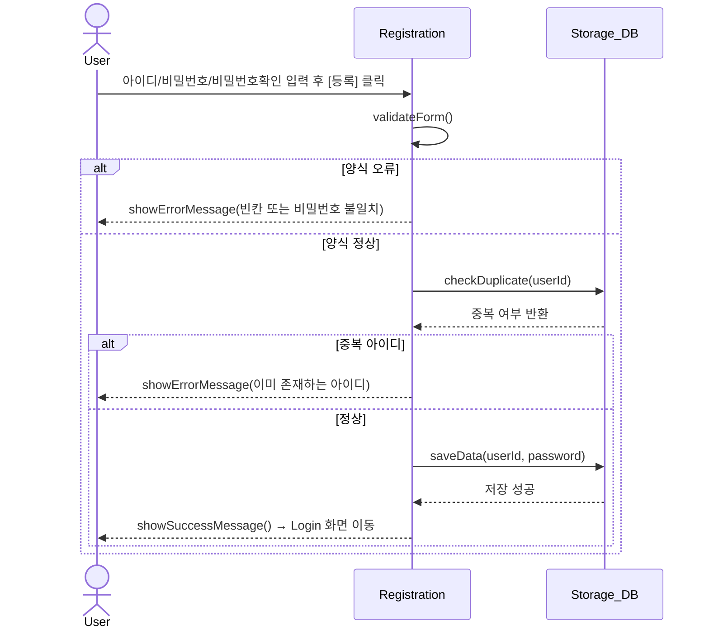
```mermaid
sequenceDiagram
  actor User
  participant R as Registration
  participant DB as Storage_DB

  User->>R: 아이디/비밀번호/비밀번호확인 입력 후 [등록] 클릭
  R->>R: validateForm()
  alt 양식 오류
    R-->>User: showErrorMessage(빈칸 또는 비밀번호 불일치)
  else 양식 정상
    R->>DB: checkDuplicate(userId)
    DB-->>R: 중복 여부 반환
    alt 중복 아이디
      R-->>User: showErrorMessage(이미 존재하는 아이디)
    else 정상
      R->>DB: saveData(userId, password)
      DB-->>R: 저장 성공
      R-->>User: showSuccessMessage() → Login 화면 이동
    end
  end
```

---

## 2) Login — 로그인

사용자가 아이디와 비밀번호를 입력하면 Login이 Storage_DB에서 레코드를 조회하고 비밀번호를 대조한다.
인증 성공 시 Pet_Instance를 로드하고 Main_Engine을 활성화하며 실패 시 오류 메시지를 출력한다.

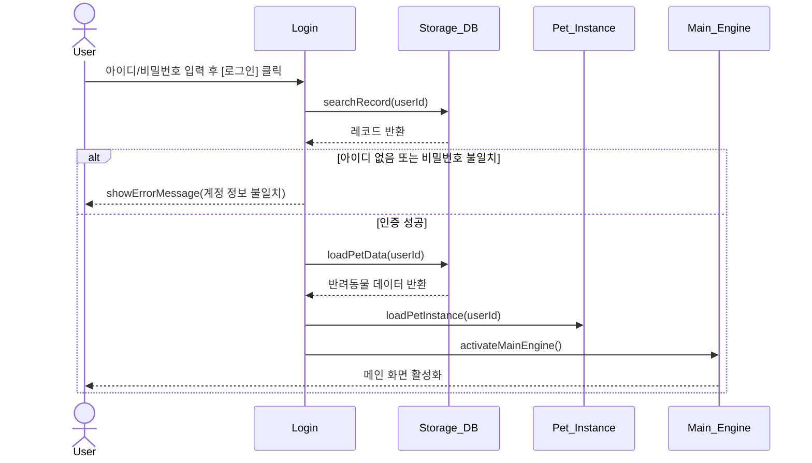
```mermaid
sequenceDiagram
  actor User
  participant L as Login
  participant DB as Storage_DB
  participant P as Pet_Instance
  participant M as Main_Engine

  User->>L: 아이디/비밀번호 입력 후 [로그인] 클릭
  L->>DB: searchRecord(userId)
  DB-->>L: 레코드 반환
  alt 아이디 없음 또는 비밀번호 불일치
    L-->>User: showErrorMessage(계정 정보 불일치)
  else 인증 성공
    L->>DB: loadPetData(userId)
    DB-->>L: 반려동물 데이터 반환
    L->>P: loadPetInstance(userId)
    L->>M: activateMainEngine()
    M-->>User: 메인 화면 활성화
  end
```

---

## 3) Pet_Instance — 반려동물 등록

로그인 후 반려동물이 없을 경우 사용자는 종(강아지/토끼/고양이/햄스터)과 이름을 선택한다.
Pet_Instance가 생성되어 기본 스탯이 할당되고 Storage_DB에 저장된다.
이름 미입력 또는 형식 오류 시 재입력을 요구한다.

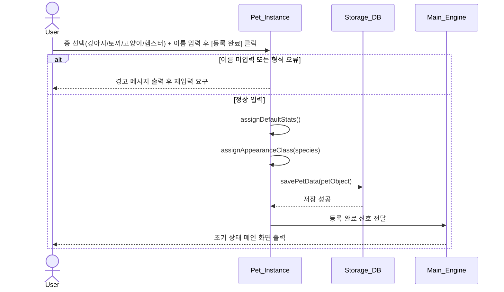
```mermaid
sequenceDiagram
  actor User
  participant P as Pet_Instance
  participant DB as Storage_DB
  participant M as Main_Engine

  User->>P: 종 선택(강아지/토끼/고양이/햄스터) + 이름 입력 후 [등록 완료] 클릭
  alt 이름 미입력 또는 형식 오류
    P-->>User: 경고 메시지 출력 후 재입력 요구
  else 정상 입력
    P->>P: assignDefaultStats()
    P->>P: assignAppearanceClass(species)
    P->>DB: savePetData(petObject)
    DB-->>P: 저장 성공
    P->>M: 등록 완료 신호 전달
    M-->>User: 초기 상태 메인 화면 출력
  end
```

---

## 4) Time_Synchronizer — 데이터 동기

로그인 완료 직후 자동 실행된다.
Time Server에서 현재 시각을 받아 마지막 접속 시각과 비교하고 경과 시간만큼 스탯을 차감한다.
네트워크 불안정 시 로컬 시간을 대체 사용하며 시간 조작이 감지되면 차감을 중단한다.

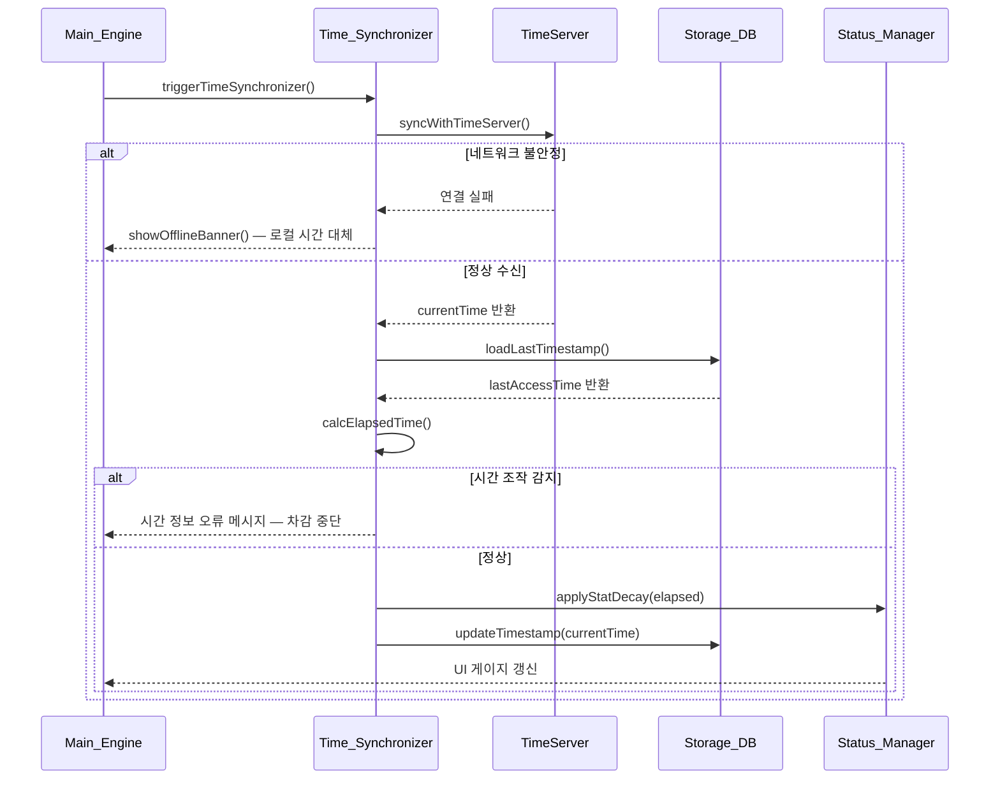
```mermaid
sequenceDiagram
  participant M as Main_Engine
  participant T as Time_Synchronizer
  participant TS as TimeServer
  participant DB as Storage_DB
  participant SM as Status_Manager

  M->>T: triggerTimeSynchronizer()
  T->>TS: syncWithTimeServer()
  alt 네트워크 불안정
    TS-->>T: 연결 실패
    T-->>M: showOfflineBanner() — 로컬 시간 대체
  else 정상 수신
    TS-->>T: currentTime 반환
    T->>DB: loadLastTimestamp()
    DB-->>T: lastAccessTime 반환
    T->>T: calcElapsedTime()
    alt 시간 조작 감지
      T-->>M: 시간 정보 오류 메시지 — 차감 중단
    else 정상
      T->>SM: applyStatDecay(elapsed)
      T->>DB: updateTimestamp(currentTime)
      SM-->>M: UI 게이지 갱신
    end
  end
```

---

## 5) Status_Monitor — 상태 확인

앱 구동 중 지속적으로 Status_Manager에서 스탯 데이터를 읽어 게이지 UI로 표시한다.
수치가 임계값 이하로 떨어지면 빨간색 강조와 감정 아이콘으로 사용자에게 경고한다.
DB 오류 시 캐시 데이터를 임시 출력한다.

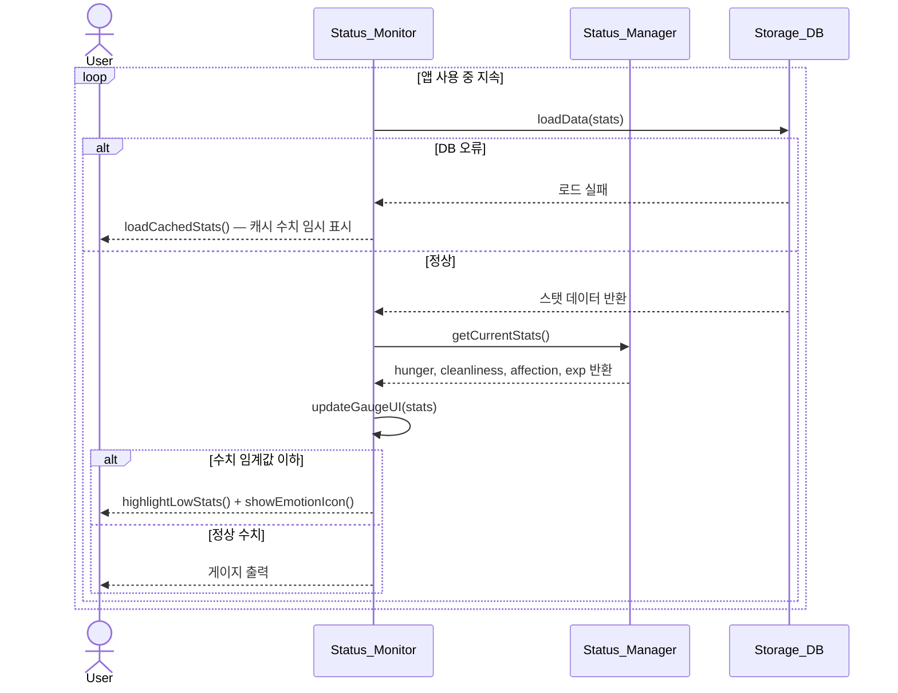
```mermaid
sequenceDiagram
  actor User
  participant MON as Status_Monitor
  participant SM as Status_Manager
  participant DB as Storage_DB

  loop 앱 사용 중 지속
    MON->>DB: loadData(stats)
    alt DB 오류
      DB-->>MON: 로드 실패
      MON-->>User: loadCachedStats() — 캐시 수치 임시 표시
    else 정상
      DB-->>MON: 스탯 데이터 반환
      MON->>SM: getCurrentStats()
      SM-->>MON: hunger, cleanliness, affection, exp 반환
      MON->>MON: updateGaugeUI(stats)
      alt 수치 임계값 이하
        MON-->>User: highlightLowStats() + showEmotionIcon()
      else 정상 수치
        MON-->>User: 게이지 출력
      end
    end
  end
```

---

## 6) Interaction_Manager — 육성 관리

사용자가 먹이/산책/씻기기/쓰다듬기 버튼을 클릭하면 하루 횟수 제한을 확인한 뒤 해당 액션의 가중치를 계산하여 Status_Manager를 갱신하고 Activity_Logger에 기록한다.
스탯이 이미 최대치거나 횟수 제한 초과 시 메시지만 출력한다.

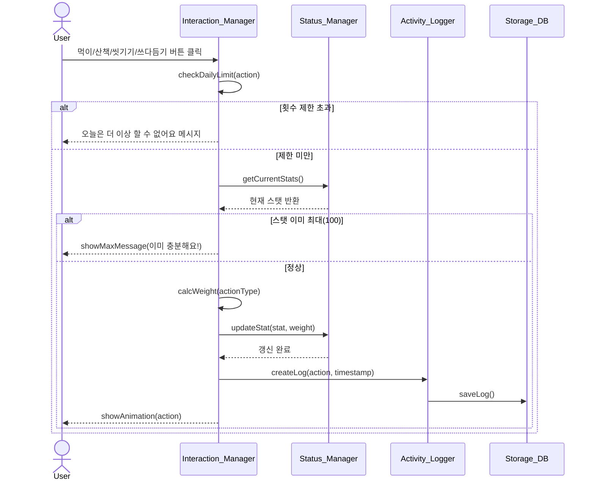
```mermaid
sequenceDiagram
  actor User
  participant IM as Interaction_Manager
  participant SM as Status_Manager
  participant AL as Activity_Logger
  participant DB as Storage_DB

  User->>IM: 먹이/산책/씻기기/쓰다듬기 버튼 클릭
  IM->>IM: checkDailyLimit(action)
  alt 횟수 제한 초과
    IM-->>User: 오늘은 더 이상 할 수 없어요 메시지
  else 제한 미만
    IM->>SM: getCurrentStats()
    SM-->>IM: 현재 스탯 반환
    alt 스탯 이미 최대(100)
      IM-->>User: showMaxMessage(이미 충분해요!)
    else 정상
      IM->>IM: calcWeight(actionType)
      IM->>SM: updateStat(stat, weight)
      SM-->>IM: 갱신 완료
      IM->>AL: createLog(action, timestamp)
      AL->>DB: saveLog()
      IM-->>User: showAnimation(action)
    end
  end
```

---

## 7) Diary_Analyzer — 일기 작성 및 교감

사용자가 일기를 작성하면 텍스트 길이와 감정 키워드를 분석하여 경험치·친밀도 가중치를 산출한다.
산출된 수치를 Status_Manager에 반영하고 일기를 Activity_Logger에 저장한다.
텍스트가 너무 짧으면 가이드 메시지를 출력한다.

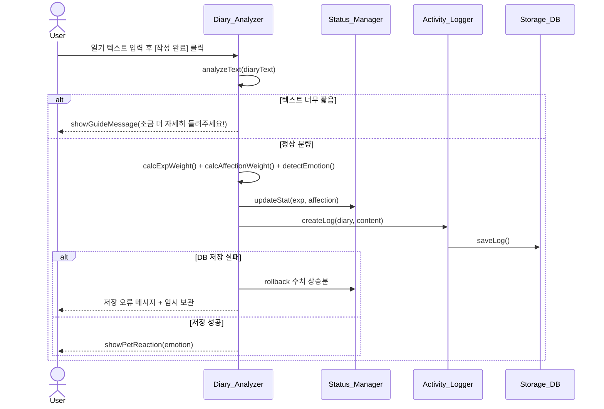
```mermaid
sequenceDiagram
  actor User
  participant DA as Diary_Analyzer
  participant SM as Status_Manager
  participant AL as Activity_Logger
  participant DB as Storage_DB

  User->>DA: 일기 텍스트 입력 후 [작성 완료] 클릭
  DA->>DA: analyzeText(diaryText)
  alt 텍스트 너무 짧음
    DA-->>User: showGuideMessage(조금 더 자세히 들려주세요!)
  else 정상 분량
    DA->>DA: calcExpWeight() + calcAffectionWeight() + detectEmotion()
    DA->>SM: updateStat(exp, affection)
    DA->>AL: createLog(diary, content)
    AL->>DB: saveLog()
    alt DB 저장 실패
      DA->>SM: rollback 수치 상승분
      DA-->>User: 저장 오류 메시지 + 임시 보관
    else 저장 성공
      DA-->>User: showPetReaction(emotion)
    end
  end
```

---

## 8) Growth_Controller — 성장 처리

스탯 갱신 시마다 경험치와 경과 시간이 성장 임계값에 도달했는지 자동으로 체크한다.
조건 충족 시 Pet_Instance의 외형 클래스를 다음 단계로 교체하고 새 리소스를 로드한 뒤 진화 연출을 출력한다.
성장 단계는 Baby → Adult → Senior 3단계이며 저장 오류 시 롤백한다.

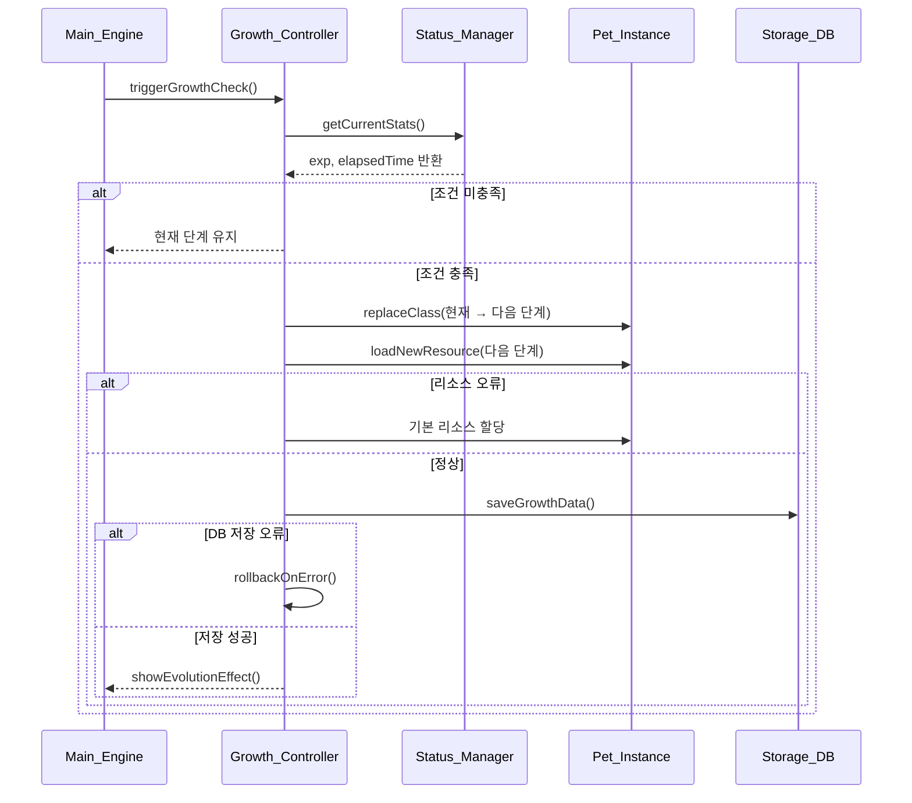
```mermaid
sequenceDiagram
  participant M as Main_Engine
  participant GC as Growth_Controller
  participant SM as Status_Manager
  participant P as Pet_Instance
  participant DB as Storage_DB

  M->>GC: triggerGrowthCheck()
  GC->>SM: getCurrentStats()
  SM-->>GC: exp, elapsedTime 반환
  alt 조건 미충족
    GC-->>M: 현재 단계 유지
  else 조건 충족
    GC->>P: replaceClass(현재 → 다음 단계)
    GC->>P: loadNewResource(다음 단계)
    alt 리소스 오류
      GC->>P: 기본 리소스 할당
    else 정상
      GC->>DB: saveGrowthData()
      alt DB 저장 오류
        GC->>GC: rollbackOnError()
      else 저장 성공
        GC-->>M: showEvolutionEffect()
      end
    end
  end
```

---

## 9) Status_Manager — 스탯 반영

Interaction_Manager 또는 Diary_Analyzer로부터 수치 변경 요청을 받아 스탯을 즉시 갱신한다.
최소·최대값을 초과하지 않도록 고정하고 Status_Monitor와 Growth_Controller에 변경 사실을 알린다.

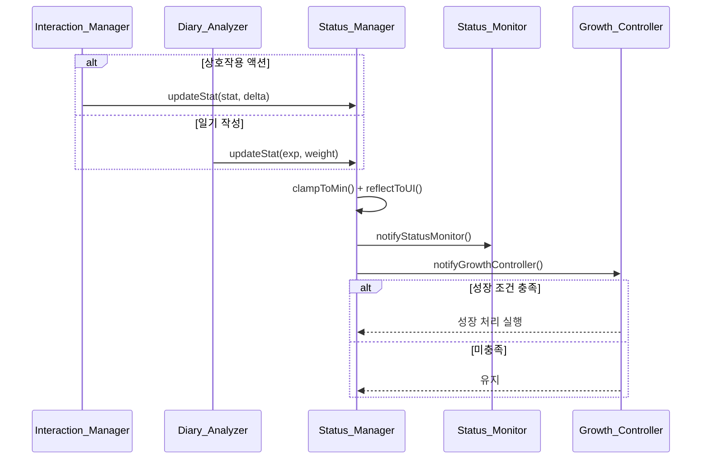
```mermaid
sequenceDiagram
  participant IM as Interaction_Manager
  participant DA as Diary_Analyzer
  participant SM as Status_Manager
  participant MON as Status_Monitor
  participant GC as Growth_Controller

  alt 상호작용 액션
    IM->>SM: updateStat(stat, delta)
  else 일기 작성
    DA->>SM: updateStat(exp, weight)
  end
  SM->>SM: clampToMin() + reflectToUI()
  SM->>MON: notifyStatusMonitor()
  SM->>GC: notifyGrowthController()
  alt 성장 조건 충족
    GC-->>SM: 성장 처리 실행
  else 미충족
    GC-->>SM: 유지
  end
```

---

## 10) Activity_Logger — 활동 로그 기록

상호작용·일기 작성 등 시스템 내 모든 이벤트를 로그로 생성하여 Storage_DB에 저장한다.
비정상 종료 시 즉시 백업하며 독립 처리 시 전체 로그를 패키징하여 Independence_Manager에 전달한다.

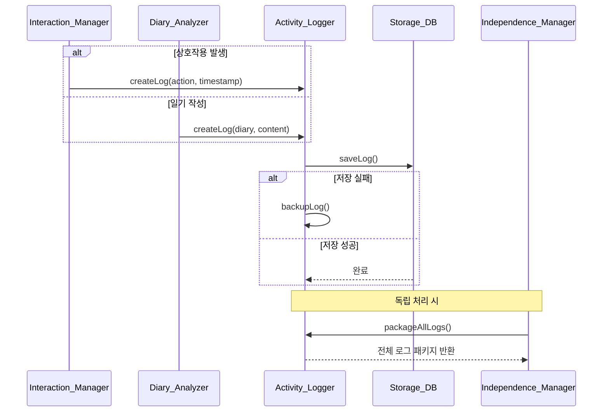
```mermaid
sequenceDiagram
  participant IM as Interaction_Manager
  participant DA as Diary_Analyzer
  participant AL as Activity_Logger
  participant DB as Storage_DB
  participant IndM as Independence_Manager

  alt 상호작용 발생
    IM->>AL: createLog(action, timestamp)
  else 일기 작성
    DA->>AL: createLog(diary, content)
  end
  AL->>DB: saveLog()
  alt 저장 실패
    AL->>AL: backupLog()
  else 저장 성공
    DB-->>AL: 완료
  end
  note over IndM,AL: 독립 처리 시
  IndM->>AL: packageAllLogs()
  AL-->>IndM: 전체 로그 패키지 반환
```

---

## 11) Storage_DB — 데이터 저장·조회

시스템의 모든 영구 데이터를 관리한다.
각 클래스로부터 읽기·쓰기·삭제·갱신 요청을 받아 처리하고 결과를 반환한다.
Flutter 구현에서는 SharedPreferences를 사용하여 웹/앱 환경 모두에서 동작한다.

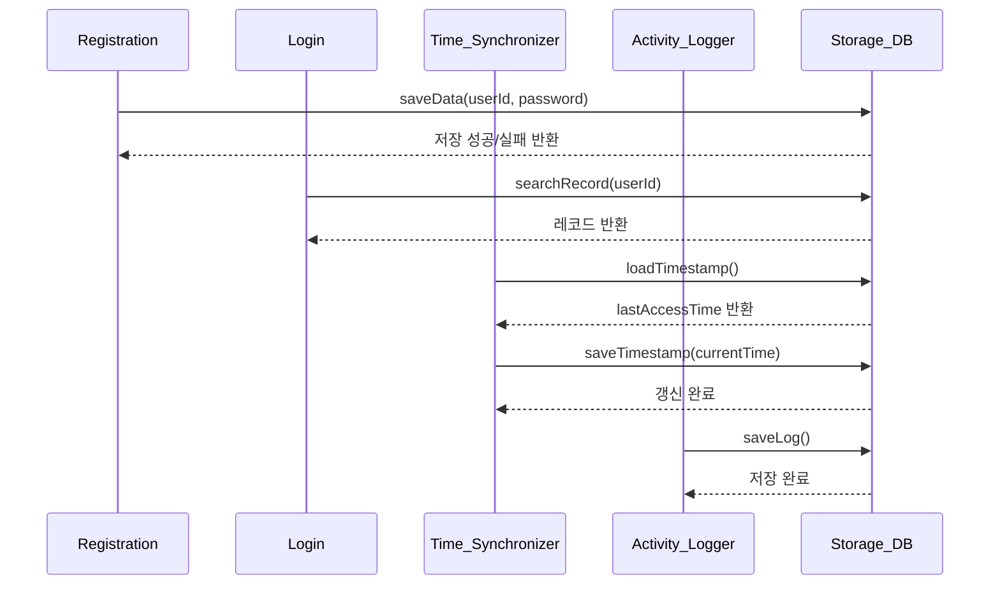
```mermaid
sequenceDiagram
  participant R as Registration
  participant L as Login
  participant T as Time_Synchronizer
  participant AL as Activity_Logger
  participant DB as Storage_DB

  R->>DB: saveData(userId, password)
  DB-->>R: 저장 성공/실패 반환
  L->>DB: searchRecord(userId)
  DB-->>L: 레코드 반환
  T->>DB: loadTimestamp()
  DB-->>T: lastAccessTime 반환
  T->>DB: saveTimestamp(currentTime)
  DB-->>T: 갱신 완료
  AL->>DB: saveLog()
  DB-->>AL: 저장 완료
```

---

## 12) Main_Engine — 전체 제어

시스템 시작점으로서 로그인 직후 Time_Synchronizer와 Growth_Controller를 순서대로 호출하고 앱 전반의 흐름을 조율한다.
모든 하위 클래스의 실행 결과를 수집하여 메인 화면 상태를 최신화한다.

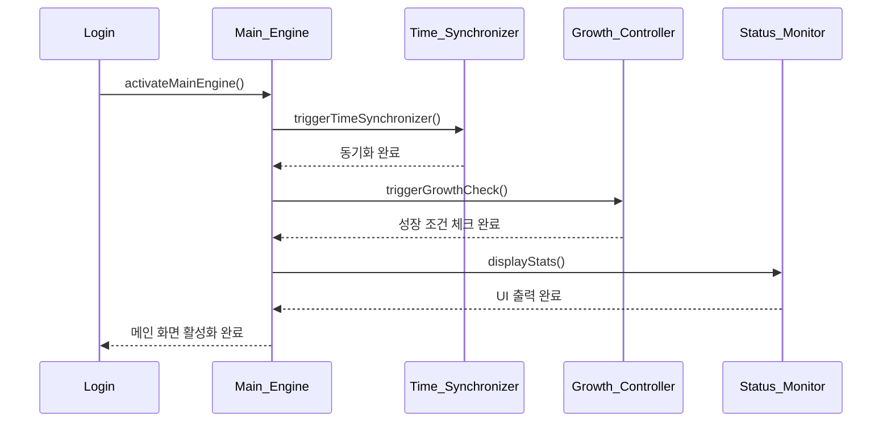
```mermaid
sequenceDiagram
  participant L as Login
  participant M as Main_Engine
  participant T as Time_Synchronizer
  participant GC as Growth_Controller
  participant MON as Status_Monitor

  L->>M: activateMainEngine()
  M->>T: triggerTimeSynchronizer()
  T-->>M: 동기화 완료
  M->>GC: triggerGrowthCheck()
  GC-->>M: 성장 조건 체크 완료
  M->>MON: displayStats()
  MON-->>M: UI 출력 완료
  M-->>L: 메인 화면 활성화 완료
```

---

## 13) Independence_Manager — 동물 독립

최종 성장을 마친 반려동물의 독립을 처리한다.
모든 활동 로그를 패키징하여 World_Server_Linker로 전송하고 성공 시 로컬 데이터를 삭제하거나 읽기 전용으로 변경한 뒤 엔딩 연출을 출력한다.

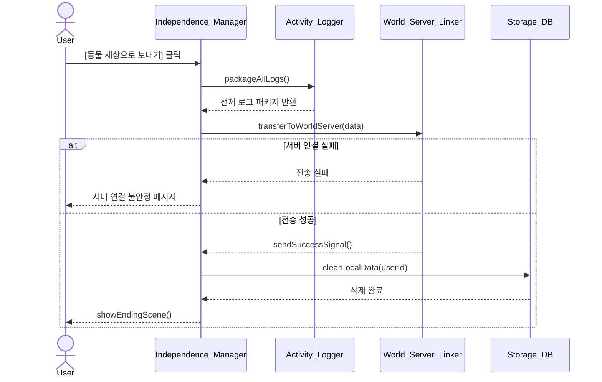
```mermaid
sequenceDiagram
  actor User
  participant IndM as Independence_Manager
  participant AL as Activity_Logger
  participant WSL as World_Server_Linker
  participant DB as Storage_DB

  User->>IndM: [동물 세상으로 보내기] 클릭
  IndM->>AL: packageAllLogs()
  AL-->>IndM: 전체 로그 패키지 반환
  IndM->>WSL: transferToWorldServer(data)
  alt 서버 연결 실패
    WSL-->>IndM: 전송 실패
    IndM-->>User: 서버 연결 불안정 메시지
  else 전송 성공
    WSL-->>IndM: sendSuccessSignal()
    IndM->>DB: clearLocalData(userId)
    DB-->>IndM: 삭제 완료
    IndM-->>User: showEndingScene()
  end
```

---

## 14) World_Server_Linker — 외부 아카이브

Independence_Manager로부터 반려동물 데이터를 수신하여 영구 기억 저장소에 보관한다.
추억 회상 시 Recall_Generator의 요청에 따라 해당 동물의 활동 로그를 다시 제공한다.

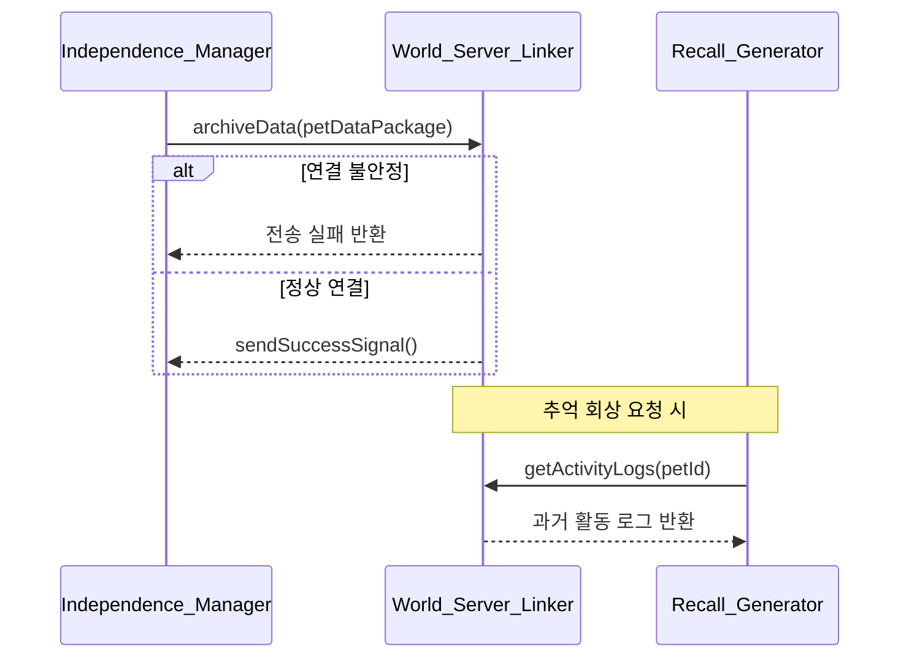
```mermaid
sequenceDiagram
  participant IndM as Independence_Manager
  participant WSL as World_Server_Linker
  participant RG as Recall_Generator

  IndM->>WSL: archiveData(petDataPackage)
  alt 연결 불안정
    WSL-->>IndM: 전송 실패 반환
  else 정상 연결
    WSL-->>IndM: sendSuccessSignal()
  end
  note over WSL,RG: 추억 회상 요청 시
  RG->>WSL: getActivityLogs(petId)
  WSL-->>RG: 과거 활동 로그 반환
```

---

## 15) Recall_Generator — 추억 회상

사용자가 독립한 반려동물을 선택하면 World_Server_Linker에서 과거 활동 로그를 가져와 무작위로 추출한 뒤 대사 템플릿에 주입하여 회상 대화를 출력한다.
로그 부족 또는 매핑 오류 시 기본 메시지로 대체한다.

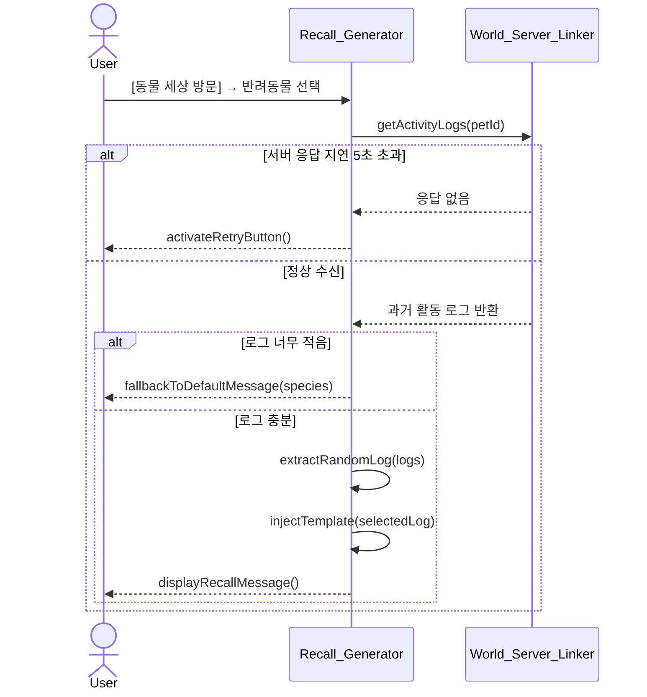
```mermaid
sequenceDiagram
  actor User
  participant RG as Recall_Generator
  participant WSL as World_Server_Linker

  User->>RG: [동물 세상 방문] → 반려동물 선택
  RG->>WSL: getActivityLogs(petId)
  alt 서버 응답 지연 5초 초과
    WSL-->>RG: 응답 없음
    RG-->>User: activateRetryButton()
  else 정상 수신
    WSL-->>RG: 과거 활동 로그 반환
    alt 로그 너무 적음
      RG-->>User: fallbackToDefaultMessage(species)
    else 로그 충분
      RG->>RG: extractRandomLog(logs)
      RG->>RG: injectTemplate(selectedLog)
      RG-->>User: displayRecallMessage()
    end
  end
```

---

## 16) Poop_Manager — 똥 시스템 *(신규)*

반려동물이 30초마다 똥을 싸며 최대 5개까지 쌓인다.
앱이 꺼진 상태에서도 경과 시간에 따라 똥이 쌓이며 사용자가 터치하면 사라지고 반려동물이 웃는다.

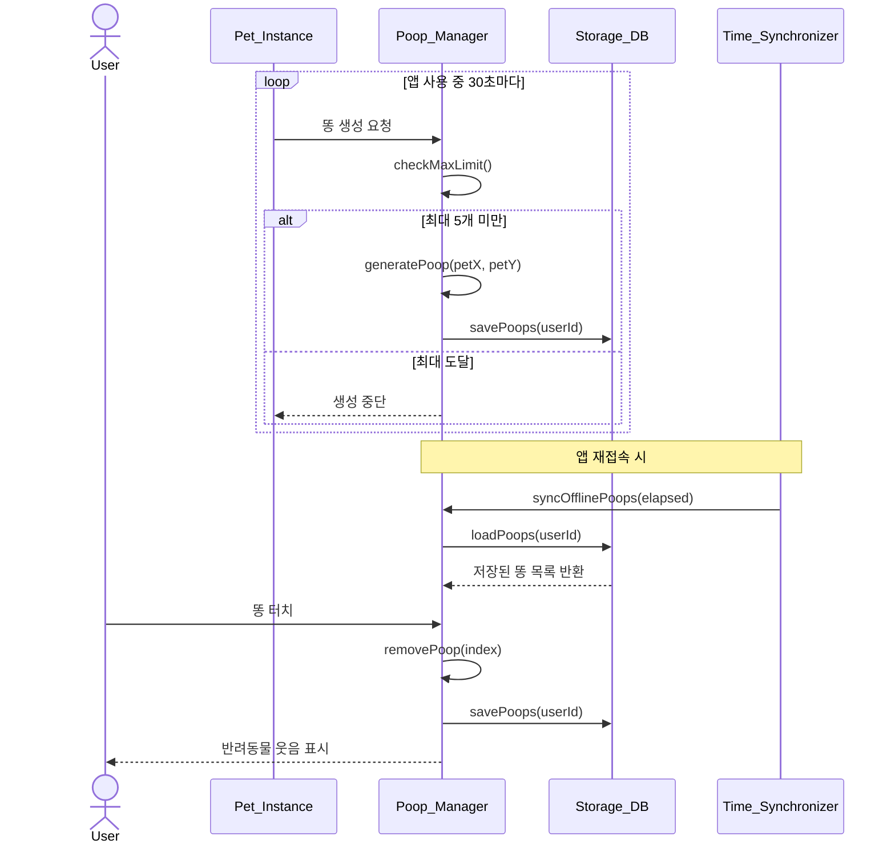
```mermaid
sequenceDiagram
  actor User
  participant P as Pet_Instance
  participant PM as Poop_Manager
  participant DB as Storage_DB
  participant T as Time_Synchronizer

  loop 앱 사용 중 30초마다
    P->>PM: 똥 생성 요청
    PM->>PM: checkMaxLimit()
    alt 최대 5개 미만
      PM->>PM: generatePoop(petX, petY)
      PM->>DB: savePoops(userId)
    else 최대 도달
      PM-->>P: 생성 중단
    end
  end

  note over T,PM: 앱 재접속 시
  T->>PM: syncOfflinePoops(elapsed)
  PM->>DB: loadPoops(userId)
  DB-->>PM: 저장된 똥 목록 반환

  User->>PM: 똥 터치
  PM->>PM: removePoop(index)
  PM->>DB: savePoops(userId)
  PM-->>User: 반려동물 웃음 표시
```

---

## 17) Mini_Game — 미니게임 *(신규)*

사용자가 키우는 반려동물이 주인공인 장애물 피하기 게임이다.
탭으로 점프, 길게 누르기로 숙이기를 수행하며 점수가 오를수록 속도가 빨라진다.

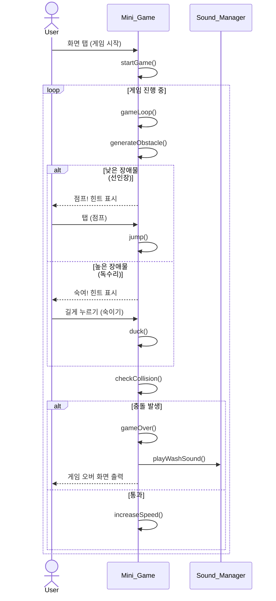
```mermaid
sequenceDiagram
  actor User
  participant MG as Mini_Game
  participant SM as Sound_Manager

  User->>MG: 화면 탭 (게임 시작)
  MG->>MG: startGame()
  loop 게임 진행 중
    MG->>MG: gameLoop()
    MG->>MG: generateObstacle()
    alt 낮은 장애물 (선인장)
      MG-->>User: 점프! 힌트 표시
      User->>MG: 탭 (점프)
      MG->>MG: jump()
    else 높은 장애물 (독수리)
      MG-->>User: 숙여! 힌트 표시
      User->>MG: 길게 누르기 (숙이기)
      MG->>MG: duck()
    end
    MG->>MG: checkCollision()
    alt 충돌 발생
      MG->>MG: gameOver()
      MG->>SM: playWashSound()
      MG-->>User: 게임 오버 화면 출력
    else 통과
      MG->>MG: increaseSpeed()
    end
  end
```

---

## 18) Sound_Manager — 사운드 관리 *(신규)*

앱 전반의 배경음악과 효과음을 관리한다.
배경음악은 메인 화면 진입 시 자동으로 시작되고 무한 반복된다.
볼륨 조절 슬라이더로 0~100% 사이에서 조절 가능하다.

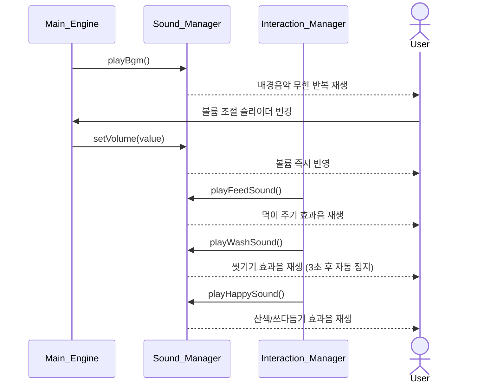
```mermaid
sequenceDiagram
  participant M as Main_Engine
  participant SM as Sound_Manager
  participant IM as Interaction_Manager
  actor User

  M->>SM: playBgm()
  SM-->>User: 배경음악 무한 반복 재생

  User->>M: 볼륨 조절 슬라이더 변경
  M->>SM: setVolume(value)
  SM-->>User: 볼륨 즉시 반영

  IM->>SM: playFeedSound()
  SM-->>User: 먹이 주기 효과음 재생

  IM->>SM: playWashSound()
  SM-->>User: 씻기기 효과음 재생 (3초 후 자동 정지)

  IM->>SM: playHappySound()
  SM-->>User: 산책/쓰다듬기 효과음 재생
```

---

# 4. State Machine Diagram

시스템 실행 시 Login 화면으로 시작하며 회원가입 버튼을 누를 시 Register 화면으로 이동한다.
회원가입이 성공하면 다시 Login 화면으로, 실패하면 Register 화면에 남아있게 된다.
로그인 성공 시 MainView로 넘어가며, 반려동물이 없을 경우 PetRegister 화면으로 이동한다.
등록 완료 후 NurturingView에서 일기 작성, 육성 관리, 성장 처리를 반복하고,
최종 성장 후 독립 처리 또는 추억 회상으로 전이된다. 로그아웃 시 다시 Login으로 돌아간다.
NurturingView에서는 🎮 버튼을 통해 미니게임으로 진입할 수 있다.

---

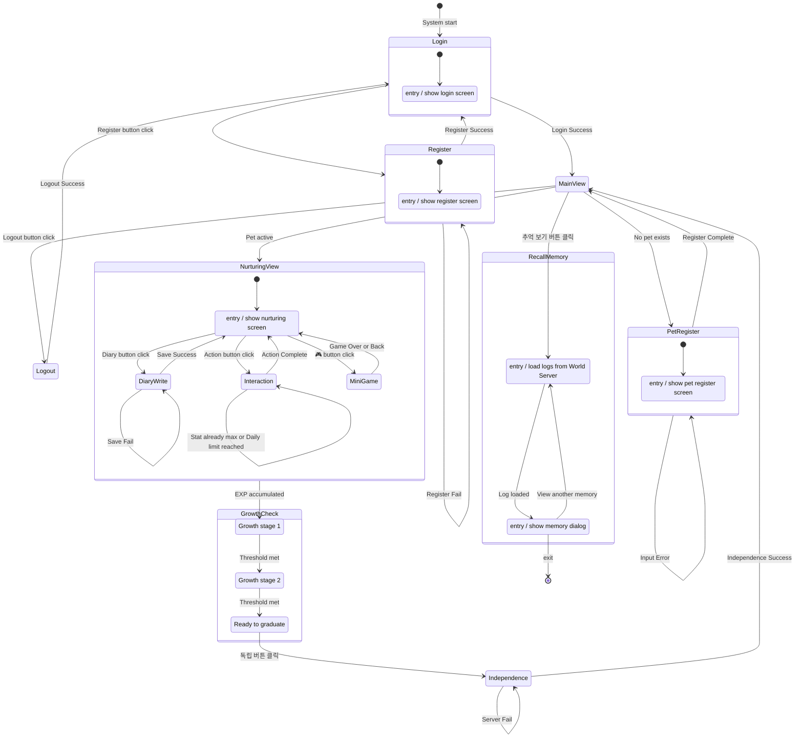
```mermaid
stateDiagram-v2
  direction TB

  [*] --> Login : System start

  Login --> Register : Register button click
  Register --> Login : Register Success
  Register --> Register : Register Fail
  Login --> MainView : Login Success

  MainView --> Logout : Logout button click
  Logout --> Login : Logout Success
  MainView --> PetRegister : No pet exists
  PetRegister --> PetRegister : Input Error
  PetRegister --> MainView : Register Complete
  MainView --> NurturingView : Pet active
  MainView --> RecallView : 추억 보기 버튼 클릭

  state Login {
    [*] --> ShowLogin
    ShowLogin : entry / show login screen
  }

  state Register {
    [*] --> ShowRegister
    ShowRegister : entry / show register screen
  }

  state PetRegister {
    [*] --> ShowPetRegister
    ShowPetRegister : entry / show pet register screen
  }

  state NurturingView {
    [*] --> ShowNurturing
    ShowNurturing : entry / show nurturing screen
    ShowNurturing --> DiaryWrite : Diary button click
    DiaryWrite --> ShowNurturing : Save Success
    DiaryWrite --> DiaryWrite : Save Fail
    ShowNurturing --> Interaction : Action button click
    Interaction --> ShowNurturing : Action Complete
    Interaction --> Interaction : Stat already max or Daily limit reached
    ShowNurturing --> MiniGame : 🎮 button click
    MiniGame --> ShowNurturing : Game Over or Back
  }

  NurturingView --> Baby : EXP accumulated

  state GrowthCheck {
    Baby --> Adult : Threshold met
    Adult --> Senior : Threshold met
    Baby : Growth stage 1
    Adult : Growth stage 2
    Senior : Ready to graduate
  }

  Senior --> Independence : 독립 버튼 클릭
  Independence --> Independence : Server Fail
  Independence --> MainView : Independence Success

  state RecallMemory {
    RecallView --> RecallMessage : Log loaded
    RecallMessage --> RecallView : View another memory
    RecallView : entry / load logs from World Server
    RecallMessage : entry / show memory dialog
  }

  RecallMessage --> [*] : exit
```

---

## 상태 전이 설명

### 1. Login — 로그인
**진입 동작**: 로그인 화면을 출력한다.

| 전이 조건 | 이동 상태 |
|---|---|
| Register button click | Register |
| Login Success | MainView |

---

### 2. Register — 회원가입
**진입 동작**: 회원가입 입력 양식을 화면에 출력한다.

| 전이 조건 | 이동 상태 |
|---|---|
| Register Success | Login |
| Register Fail | Register (자기 자신, 재입력 유도) |

---

### 3. Logout — 로그아웃
**진입 동작**: 세션을 종료하고 인증 정보를 초기화한다.

| 전이 조건 | 이동 상태 |
|---|---|
| Logout button click | Logout |
| Logout Success | Login |

---

### 4. MainView — 메인 화면
**진입 동작**: 메인 육성 화면을 활성화하고 반려동물 상태를 출력한다.

| 전이 조건 | 이동 상태 |
|---|---|
| No pet exists | PetRegister |
| Pet active | NurturingView |
| 추억 보기 버튼 클릭 | RecallView |
| Logout button click | Logout |
| Independence Success | MainView (새 사이클 시작) |

---

### 5. PetRegister — 반려동물 등록
**진입 동작**: 반려동물 종 선택(강아지/토끼/고양이/햄스터) 및 이름 입력 화면을 출력한다.

| 전이 조건 | 이동 상태 |
|---|---|
| Input Error (이름 미입력 또는 형식 오류) | PetRegister (자기 자신, 재입력 유도) |
| Register Complete | MainView |

---

### 6. NurturingView — 육성 화면
**진입 동작**: 반려동물이 화면을 자유롭게 돌아다니며 스탯 게이지와 상호작용 버튼을 출력한다.
강아지/토끼는 산책 버튼, 고양이/햄스터는 쓰다듬기 버튼이 표시된다.

| 전이 조건 | 이동 상태 |
|---|---|
| Diary button click | DiaryWrite |
| Action button click (먹이/씻기/산책 또는 쓰다듬기) | Interaction |
| 🎮 button click | MiniGame |
| EXP accumulated (경험치 누적) | GrowthCheck (Baby 단계 시작) |

---

### 7. DiaryWrite — 일기 작성
**진입 동작**: 오늘 날짜와 함께 일기 텍스트 입력 폼을 화면에 출력한다.

| 전이 조건 | 이동 상태 |
|---|---|
| Save Success | NurturingView |
| Save Fail (DB 오류) | DiaryWrite (자기 자신, 임시 보관) |

---

### 8. Interaction — 육성 상호작용
**진입 동작**: 선택된 액션의 가중치를 계산하고 스탯을 갱신한다.

| 전이 조건 | 이동 상태 |
|---|---|
| Action Complete | NurturingView |
| Stat already max (스탯 최대치) | Interaction (자기 자신, 메시지 출력) |
| Daily limit reached (하루 횟수 초과) | Interaction (자기 자신, 메시지 출력) |

---

### 9. MiniGame — 미니게임 *(신규)*
**진입 동작**: 키우는 반려동물이 주인공인 장애물 피하기 게임을 시작한다.
탭으로 점프, 길게 누르기로 숙이기를 수행하며 점수에 따라 속도가 증가한다.

| 전이 조건 | 이동 상태 |
|---|---|
| Game Over | MiniGame (자기 자신, 재시작 대기) |
| Back button | NurturingView |

---

### 10. GrowthCheck — 성장 단계 (Baby → Adult → Senior)
**진입 동작**: 경험치와 경과 시간이 임계값에 도달할 때마다 다음 단계로 자동 전이된다.

| 현재 상태 | 전이 조건 | 이동 상태 |
|---|---|---|
| Baby | Threshold met | Adult |
| Adult | Threshold met | Senior |
| Senior | 독립 버튼 클릭 | Independence |

---

### 11. Independence — 동물 독립
**진입 동작**: 반려동물의 전체 데이터를 패키징하여 World Server로 전송한다.

| 전이 조건 | 이동 상태 |
|---|---|
| Server Fail (서버 연결 실패) | Independence (자기 자신, 재시도 대기) |
| Independence Success | MainView (새 반려동물 등록 가능 상태) |

---

### 12. RecallView — 추억 보기
**진입 동작**: World Server에서 독립한 반려동물의 활동 로그를 불러온다.
전체 일기 목록을 펼쳐보거나 다른 추억을 랜덤으로 불러올 수 있다.

| 전이 조건 | 이동 상태 |
|---|---|
| Log loaded | RecallMessage |

---

### 13. RecallMessage — 추억 메시지 출력
**진입 동작**: 랜덤 추출된 과거 로그를 대사 템플릿에 주입하여 회상 대화를 날짜와 함께 출력한다.

| 전이 조건 | 이동 상태 |
|---|---|
| View another memory | RecallView |
| exit | 종료점 [*] |

---

# 5. Implementation Requirements

## 5.1 H/W Platform Requirements

| 항목 | 요구 사양 |
|---|---|
| Device | Android 6.0 이상 스마트폰 또는 iPhone 8 이상 |
| CPU | 1.5GHz 이상 |
| RAM | 2GB 이상 |
| Storage | 200MB 이상의 여유 공간 |

## 5.2 S/W Platform Requirements

| 항목 | 요구 사양 |
|---|---|
| Android OS | Android 6.0 (API Level 23) 이상 |
| iOS | iOS 15.0 이상 |
| 개발 언어 | Dart (Flutter 3.44.2) |
| 개발 환경 | VS Code + Flutter SDK |
| 데이터 저장 | SharedPreferences (로컬) |
| 오디오 | audioplayers 패키지 |
| 네트워크 | Time Server 연동을 위한 인터넷 연결 권장 (오프라인 부분 동작 가능) |

---

# 6. Glossary

| Term | Description |
|---|---|
| 메타데이터 | 데이터에 관한 구조화된 데이터 |
| 콜백함수 | 다른 함수의 인자로써 이용되는 함수 |
| 다형성 | 객체 지향 프로그래밍에서 동일한 인터페이스로 다양한 타입의 객체를 처리할 수 있는 특성. 성장 단계 전이 시 활용된다 |
| 롤백 | 오류 발생 시 트랜잭션을 이전 상태로 되돌리는 복구 처리 |
| Sequence Diagram | 객체 간의 동적 상호작용을 시간적 개념으로 모델링하여 나타낸 다이어그램 |
| State Machine Diagram | 객체 LifeTime 동안 변화될 수 있는 모든 상태를 정의해둔 다이어그램 |
| SharedPreferences | Flutter에서 키-값 형태로 데이터를 로컬 저장하는 패키지. 웹과 앱 모두에서 동작한다 |
| 똥 시스템 | 반려동물이 일정 시간마다 똥을 싸는 기능. 최대 5개까지 쌓이며 터치 시 제거된다 |
| 미니게임 | 키우는 반려동물이 주인공인 장애물 점프 게임. 점프와 숙이기로 장애물을 피한다 |
| 하루 횟수 제한 | 밥주기 2회, 산책 2회, 씻기기 1회, 쓰다듬기 2회로 하루 상호작용 횟수를 제한한다 |

---

# 7. References

## 강의 자료

- 강의자료 : Structural Modeling I, II
- 강의자료 : Behavior Modeling I, II

## 공식 문서

- Flutter 공식 문서  
  https://flutter.dev/docs

- Dart 공식 문서  
  https://dart.dev/guides

- audioplayers 패키지  
  https://pub.dev/packages/audioplayers

- shared_preferences 패키지  
  https://pub.dev/packages/shared_preferences

## 다이어그램 작성 참고

- Mermaid.js 공식 문서 — Class Diagram  
  https://mermaid.js.org/syntax/classDiagram.html

- Mermaid.js 공식 문서 — Sequence Diagram  
  https://mermaid.js.org/syntax/sequenceDiagram.html

- Mermaid.js 공식 문서 — State Diagram  
  https://mermaid.js.org/syntax/stateDiagram.html

- GitHub Docs — Creating diagrams with Mermaid  
  https://docs.github.com/en/get-started/writing-on-github/working-with-advanced-formatting/creating-diagrams

## UML 설계 참고

- UML Specification — Use Case Diagram  
  https://www.uml-diagrams.org/use-case-diagrams.html

- UML Specification — Sequence Diagram  
  https://www.uml-diagrams.org/sequence-diagrams.html

- UML Specification — State Machine Diagram  
  https://www.uml-diagrams.org/state-machine-diagrams.html

- UML Specification — Class Diagram  
  https://www.uml-diagrams.org/class-diagrams-overview.html

